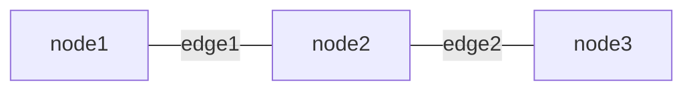
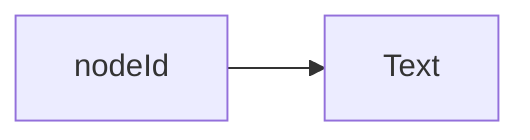
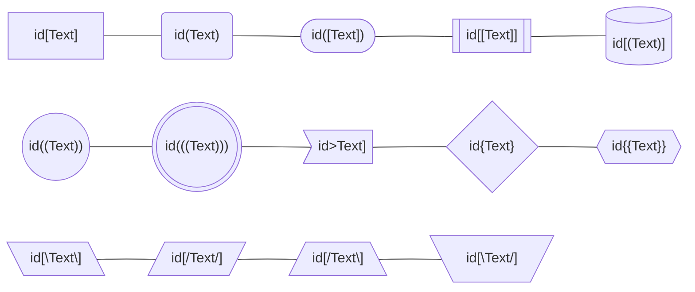
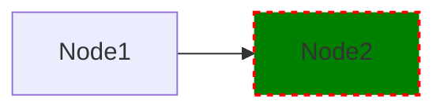
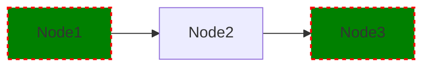
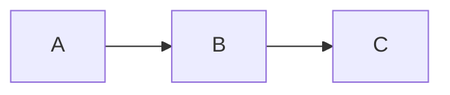
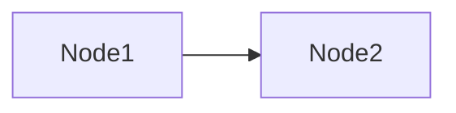
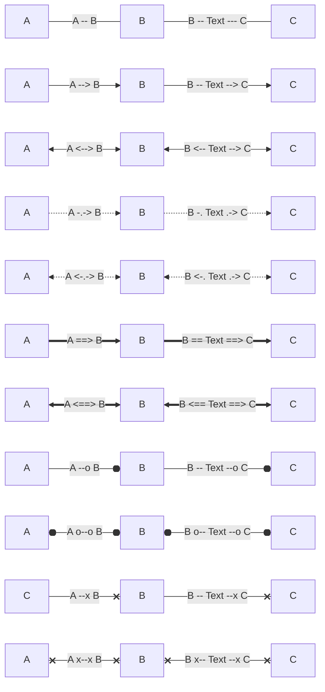
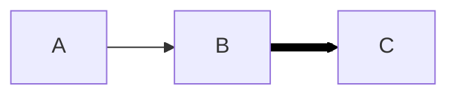
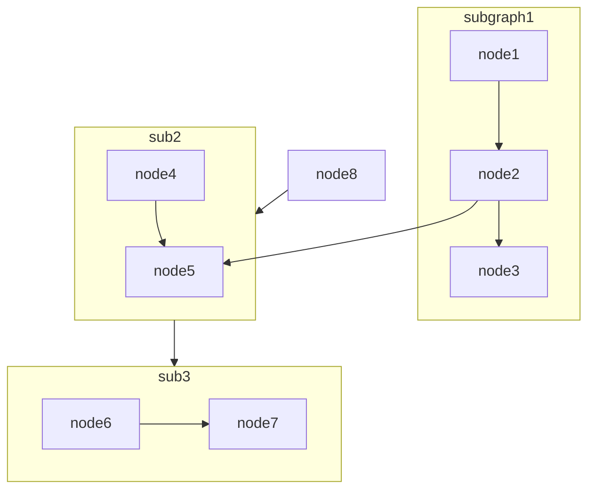

# **Mermaid Flowchart**
<br>

## **Table Of Contents**
<br>

- [**Mermaid Flowchart**](#mermaid-flowchart)
  - [**Table Of Contents**](#table-of-contents)
  - [**General**](#general)
  - [**Comments**](#comments)
  - [**Nodes**](#nodes)
    - [**General**](#general-1)
    - [**Shapes**](#shapes)
    - [**Style**](#style)
      - [**Single Node**](#single-node)
      - [**Style Class**](#style-class)
    - [**Tooltips**](#tooltips)
  - [**Edges**](#edges)
    - [**General**](#general-2)
    - [**Shapes**](#shapes-1)
    - [**Style**](#style-1)
  - [**Subgraphs**](#subgraphs)
  - [**Escape Special Syntax Characters**](#escape-special-syntax-characters)

<br>
<br>
<br>

## **General**
<br>

A flowchart consists of of _nodes_ and _edges_ between the nodes.

<br>



<br>
<br>
<br>

## **Comments**
<br>

```
flowchart LR
    %% This is a comment
    node1 --> node2
```

<br>
<br>
<br>

## **Nodes**
<br>
<br>

### **General**
<br>

```
flowchart LR
    nodeId --> id2[Text]
```



<br>
<br>

### **Shapes**
<br>



<br>
<br>

### **Style**
<br>
<br>

#### **Single Node**
<br>

```
flowchart LR
    A[Node1] --> B[Node2]
    style B fill:green,stroke:red,stroke-width:2px,stroke-dasharray: 4 4;
```

<br>



<br>
<br>

#### **Style Class**
<br>

* Style class can be defined inside the diagram definition or can reference an existing css class

```
flowchart LR
    A[Node1] --> B[Node2] --> C[Node3]
    classDef myStyleClass fill:green,stroke:red,stroke-width:2px,stroke-dasharray: 4 4;
    class A,C myStyleClass;
```

<br>

Shorthand:

```
flowchart LR
    A[Node1]:::myStyleClass --> B[Node2] --> C[Node3]:::myStyleClass
    classDef myStyleClass fill:green,stroke:red,stroke-width:2px,stroke-dasharray: 4 4;
```

<br>




<br>
<br>

### **Tooltips**
<br>

* requires _securityLevel='loose'_

<br>

```html
<script>
    var callback = function() {
        /* implementation */
    }
</script>
```

<br>

```
flowchart LR
    A --> B --> C
    click A callback "Tooltip A"
    click B "https://www.github.com" "Tooltip B For Link" _blank
```

<br>

|Link Targets |Description
|:------------|:--------------
|_self        |open link in current tab
|_blank       |open link in new tab

<br>



<br>
<br>
<br>

## **Edges**
<br>
<br>

### **General**
<br>

```
flowchart LR
    id1[Node1] --> id2[Node2]
```



<br>
<br>

### **Shapes**
<br>



<br>
<br>

### **Style**
<br>

```
flowchart LR
    A --> B --> C
    linkStyle 1 stroke:black,stroke-width:6px,color:black;
```

<br>



<br>
<br>
<br>

## **Subgraphs**
<br>
<br>

```
flowchart TB
    node2 --> node5
    
    subgraph sub1[subgraph1]
        node1 --> node2
        node2 --> node3
    end

    subgraph sub2
        direction BT
        node4 --> node5
    end

    subgraph sub3
        node6 --> node7
    end
    sub2 --> sub3
    node8 --> sub2
```

<br>



<br>
<br>
<br>

## **Escape Special Syntax Characters**
<br>
<br>

```
flowchart LR
    a("Text with special syntax characters")
```