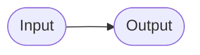

# Base Components

 

## Table Of Contents

 

- [Base Components](#base-components)
  - [Table Of Contents](#table-of-contents)
  - [Code Converter](#code-converter)
  - [Adders](#adders)
    - [Half Adder (HA)](#half-adder-ha)
    - [Full Adder (FA)](#full-adder-fa)
    - [Parallel Adder](#parallel-adder)
      - [Normal Form Parallel Adder](#normal-form-parallel-adder)
      - [Ripple-Carry Adder](#ripple-carry-adder)
  - [Comparator](#comparator)
  - [Multiplexer](#multiplexer)
  - [Demultiplexer](#demultiplexer)

 
 
 
 

## Code Converter

> A **code converter** converts converts codes between a specific input and output set.  
> It therefore changes the representation of data.

 

 

 
 
 
 

## Adders

> An **adder** adds two dual numbers.

 
 
 

### Half Adder (HA)

> A **half adder** adds two single-digit dual numbers and returns the sum and carry.

 

 

**Implementation**

$S = (A \land \overline{B}) \lor (\overline{A} \land B) = A \oplus B$

$C = A \land B$

 
 
 

### Full Adder (FA)

> A **full adder** adds two single-digit dual numbers with carry input and returns the sum and carry.

 

 

**Implementation**

$S = A \oplus B \oplus C$

$C = (A \land B) \lor (A \lor B) \land C$

 
 
 

### Parallel Adder

> A **parallel adder** adds two multi-digit dual numbers.

 
 

#### Normal Form Parallel Adder

> A **normal form parallel adder** adds two multi-digit dual numbers with a 3-tier architecture consisting of NOT, AND and OR.

 

| Advantages                                              | Disadvantages      |
| :------------------------------------------------------ | :----------------- |
| constant execution time                                 | high hardware cost |
| execution time is independent of amount of input digits |                    |

 

 

**Implementation**

Example with three digits.

 
 

#### Ripple-Carry Adder

> A **ripple-carry adder** adds two multi-digit dual numbers with a multi-tier architecture consisting of a half adder for the lowest digit and full adders for all other digits.

 

 
 
 
 

## Comparator

> A **comparator** compares two dual numbers.

 

 
 
 
 

## Multiplexer

> A **multiplexer** selects one of multiple inputs based on the value of the control inputs.

 

 
 
 
 

## Demultiplexer

> A **demultiplexer** selects one of multiple output lines for an input based on the value of the control inputs.

 

