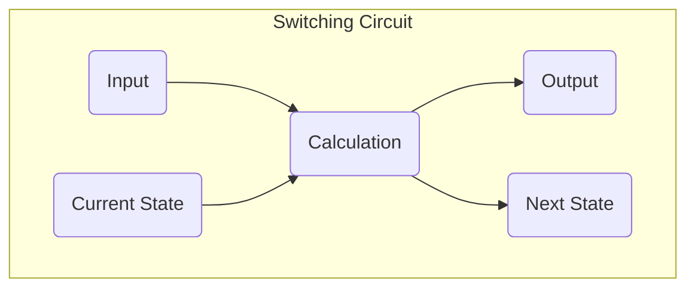
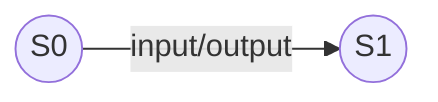
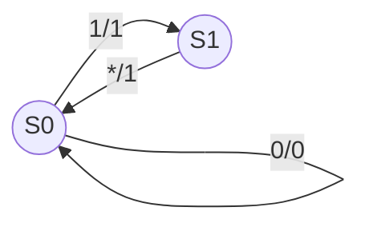
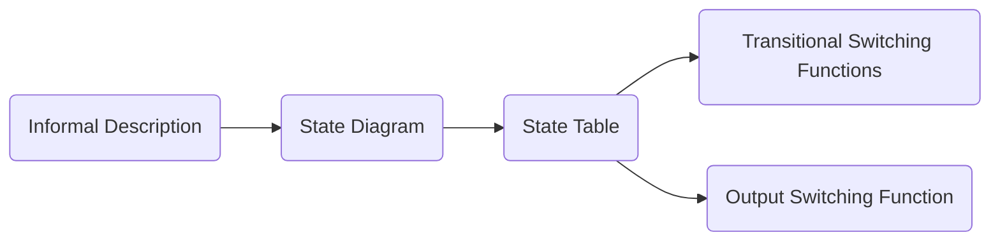
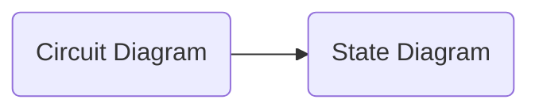
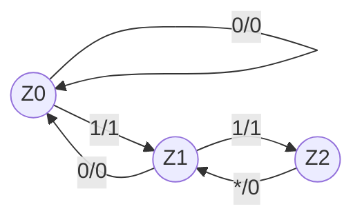

# Switching Circuit
 

## Table Of Contents
 

- [Switching Circuit](#switching-circuit)
  - [Table Of Contents](#table-of-contents)
  - [Definition](#definition)
    - [State](#state)
    - [Output](#output)
  - [Switching Circuit Types](#switching-circuit-types)
    - [Mealy Machine](#mealy-machine)
    - [Moore Machine](#moore-machine)
  - [Diagrams](#diagrams)
    - [State Diagram](#state-diagram)
    - [Circuit Diagram](#circuit-diagram)
  - [Synthesis](#synthesis)
    - [1. Create State Diagram](#1-create-state-diagram)
    - [2. Create State Table](#2-create-state-table)
    - [3. Create Transitional Switching Functions](#3-create-transitional-switching-functions)
    - [4. Create Output Switching Function](#4-create-output-switching-function)
  - [Analysis](#analysis)
    - [1. Create Transitional Switching Functions](#1-create-transitional-switching-functions)
    - [2. Create Output Switching Function](#2-create-output-switching-function)
    - [3. Create State Table](#3-create-state-table)
    - [4. Create State Diagram](#4-create-state-diagram)

 
 
 
 

## Definition

> A **switching circuit** sequentially calculates a result based on an input and saves the intermediate result between each step.

 

 

 
 
 

### State

> The state of the switching circuit is calculated by the **transitional switching functions** based on the 
> - input of the current step
> - stored state of the previous step

 

 
 
 

### Output

> The output of the switching circuit is calculated by the **output switching function** based on the
> - input of the current step
> - stored state of the previous step

 
 
 
 

## Switching Circuit Types
 
 

### Mealy Machine

> A **Mealy machine** is a switching circuit where the transitional behavior of each possible state is defined for each possible input.

 
 

### Moore Machine

> A **Moore Machine** is a Mealy machine where the output depends only on the current state, and **not** on the input.

 
 
 
 

## Diagrams
 
 

### State Diagram

We can model a switching circuit with a state model:

 
 

Example:

 

- State `S0` 
  - input `0` generates output `0` and transitions to state `S0`
  - input `1` generates output `1` and transitions to state `S1`
- State `S1`
  - any input generates output `1` and transitions to state `S0`

 
 
 

### Circuit Diagram

 
 
 
 

## Synthesis 

> The goal of the synthesis of switching circuits is to derive the transitional and output switching functions from an informal description of the switching circuits.

 

 
 
 

### 1. Create State Diagram

We create the state diagram based on the given informal description.

1. Draw all states as nodes
2. Draw all state transitions as edges
3. Add input and output information

 

 
 
 

### 2. Create State Table
 
 

1. Enter all possible combinations of current states

|Current State |Input |Output |Next State |
|:-------------|:-----|:------|:----------|
|0             |0     |       |           |
|0             |1     |       |           |
|1             |0     |       |           |
|1             |1     |       |           |

 
 

2. Determine the output and the next state for each combination based on the state diagram

|Current State |Input |Output |Next State |
|:-------------|:-----|:------|:----------|
|0             |0     |0      |0          |
|0             |1     |1      |1          |
|1             |0     |1      |0          |
|1             |1     |1      |0          |

 
 

3. Combine lines with identical current state, output and next state

|Current State |Input |Output |Next State |
|:-------------|:-----|:------|:----------|
|0             |0     |0      |0          |
|0             |1     |1      |1          |
|1             |*     |1      |0          |

 
 
 

### 3. Create Transitional Switching Functions
 

Create a [DNF](../switchingFunction/switching_function.md#disjunctive-normal-form-dnf--df) for each next state $s_x^+$ and minimize it.

$s_0^+ = (s_0 \land \overline{input}) \lor s_1$

$s_1^+ = (s_0 \land input)$

 
 
 

### 4. Create Output Switching Function
 

Create a [DNF](../switchingFunction/switching_function.md#disjunctive-normal-form-dnf--df) for the output and minimize it.

$output = (s_0 \land input) \lor s_1$

 
 
 
 

## Analysis

> The goal of the analysis of switching circuits is to derive the state diagram from an circuit diagram.
 

 

 
 
 

### 1. Create Transitional Switching Functions

$z_0^+ = (z_0 \lor z_1) \land \overline{x}$  
$z_1^+ = (x \land z_0) \lor z_2$  
$z_2^+ = x \land z_1$

 
 
 

### 2. Create Output Switching Function

$y = (z_0 \lor z_1) \land x$

 
 
 

### 3. Create State Table
 
 

1. Enter all possible combinations of current states

|Current State  $z_0z_1z_2$ |Input  $x$ |Output  $y$ |Next State  $z_0^+z_1^+z_2^+$ |
|:----------------------------:|:------------:|:-------------:|:-------------------------------:|
|100                           |0             |               |                                 |
|100                           |1             |               |                                 |
|010                           |0             |               |                                 |
|010                           |1             |               |                                 |
|001                           |0             |               |                                 |
|001                           |1             |               |                                 |

 
 

2. Determine the output and the next state for each combination based on the transitional and output switching functions

|Current State  $z_0z_1z_2$ |Input  $x$ |Output  $y$ |Next State  $z_0^+z_1^+z_2^+$   |
|:----------------------------:|:------------:|:-------------:|:---------------------------------:|
|100                           |0             |0              |100                                |
|100                           |1             |1              |010                                |
|010                           |0             |0              |100                                |
|010                           |1             |1              |001                                |
|001                           |0             |0              |010                                |
|001                           |1             |0              |010                                |

 
 

3. Combine lines with identical current state, output and next state

|Current State  $z_0z_1z_2$ |Input  $x$ |Output  $y$ |Next State  $z_0^+z_1^+z_2^+$   |
|:----------------------------:|:------------:|:-------------:|:---------------------------------:|
|100                           |0             |0              |100                                |
|100                           |1             |1              |010                                |
|010                           |0             |0              |100                                |
|010                           |1             |1              |001                                |
|001                           |*             |0              |010                                |

 
 
 

### 4. Create State Diagram
 
 

1. Draw a node for each state in the table
2. Draw an edge for each transition
3. Add input and output information

