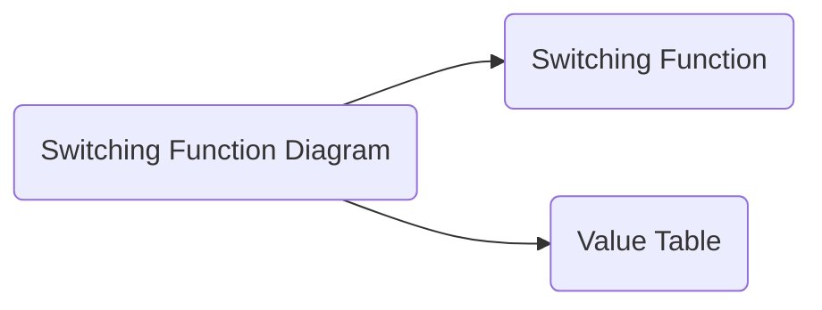

# Switching Function: Analysis
 

## Table Of Contents

- [Switching Function: Analysis](#switching-function-analysis)
  - [Table Of Contents](#table-of-contents)
  - [Analysis](#analysis)

 
 
 
 

## Analysis

> The goal of the analysis of a switching function diagram is to derive the function definition and/or its value table.

 

 
 
 

**Prerequisite**

Mark all connection symbols with intermediate functions $s_1, ..., s_n$.

 
 
 

**Derive switching function**
 

**Step 1**: Determine the intermediate function definitions.

$S_1 = a \land b \land c$  
$S_2 = a \lor b \lor c$  
$S_3 = a \land b$  
$S_4 = b \land c$  
$S_5 = a \land c$  
$S_6 = S_3 \lor S_4 \lor S_5$  
$S_7 = S_2 \land \overline{S_6}$  
$S_8 = S_1 \lor S_7$

 
 

**Step 2**: Replace intermediate functions with their definitions and minimize it

$$
\begin{align*}
   Y_1 &= S_6 \\
       &= S_3 \lor S_4 \lor S_5 \\
       &= ab \lor bc \lor ac
\end{align*}
$$

 

$$
\begin{align*}
   Y_2 &= S_8 \\
       &= S_1 \lor S_7 \\
       &= abc \lor S_2\overline{S_6} \\
       &= abc \lor (a \lor b \lor c)\overline{S_6} \\
       &= abc \lor a\overline{S_6} \lor b\overline{S_6} \lor c\overline{S_6} \\
       &= abc \lor a\overline{b}\overline{c} \lor \overline{a}b\overline{c} \lor \overline{a}\overline{b}c
\end{align*}
$$

 
 
 

**Derive Value Table**
 

**Step 1**: Insert all input variable combinations

|Input $abc$ |$S_1$  $abc$ |$S_2$  $a \lor b \lor c$ |$S_3$  $ab$ |$S_4$  $bc$ |$S_5$  $ac$ |$S_6 = Y_1$  $S_3 \lor S_4 \lor S_5$ |$S_7$  $S_2 \land \overline{S_6}$ |$Y_2$  $S_1 \lor S_7$ |
|:----:|:----:|:----:|:----:|:----:|:----:|:----:|:----:|:----:|
|000   |      |      |      |      |      |      |      |      |
|001   |      |      |      |      |      |      |      |      |
|010   |      |      |      |      |      |      |      |      |
|011   |      |      |      |      |      |      |      |      |
|100   |      |      |      |      |      |      |      |      |
|101   |      |      |      |      |      |      |      |      |
|110   |      |      |      |      |      |      |      |      |
|111   |      |      |      |      |      |      |      |      |

 
 

**Step 2**: Determine the results of the intermediate functions

|Input $abc$ |$S_1$  $abc$ |$S_2$  $a \lor b \lor c$ |$S_3$  $ab$ |$S_4$  $bc$ |$S_5$  $ac$ |$S_6 = Y_1$  $S_3 \lor S_4 \lor S_5$ |$S_7$  $S_2 \land \overline{S_6}$ |$Y_2$  $S_1 \lor S_7$ |
|:----:|:----:|:----:|:----:|:----:|:----:|:----:|:----:|:----:|
|000   |0     |0     |0     |0     |0     |0     |      |      |
|001   |0     |1     |0     |0     |0     |0     |      |      |
|010   |0     |1     |0     |0     |0     |0     |      |      |
|011   |0     |1     |1     |0     |0     |1     |      |      |
|100   |0     |1     |0     |0     |0     |0     |      |      |
|101   |0     |1     |0     |0     |1     |1     |      |      |
|110   |0     |1     |0     |1     |0     |1     |      |      |
|111   |1     |1     |1     |1     |1     |1     |      |      |

 
 

**Step 3**: Determine the results of the output functions

|Input $abc$ |$S_1$  $abc$ |$S_2$  $a \lor b \lor c$ |$S_3$  $ab$ |$S_4$  $bc$ |$S_5$  $ac$ |$S_6 = Y_1$  $S_3 \lor S_4 \lor S_5$ |$S_7$  $S_2 \land \overline{S_6}$ |$Y_2$  $S_1 \lor S_7$ |
|:----:|:----:|:----:|:----:|:----:|:----:|:----:|:----:|:----:|
|000   |0     |0     |0     |0     |0     |0     |0     |0     |
|001   |0     |1     |0     |0     |0     |0     |1     |1     |
|010   |0     |1     |0     |0     |0     |0     |1     |1     |
|011   |0     |1     |1     |0     |0     |1     |0     |0     |
|100   |0     |1     |0     |0     |0     |0     |1     |1     |
|101   |0     |1     |0     |0     |1     |1     |0     |0     |
|110   |0     |1     |0     |1     |0     |1     |0     |0     |
|111   |1     |1     |1     |1     |1     |1     |0     |1     |

