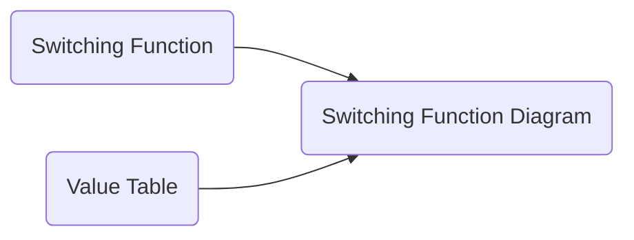

# Switching Function: Synthesis
 

## Table Of Contents

- [Switching Function: Synthesis](#switching-function-synthesis)
  - [Table Of Contents](#table-of-contents)
  - [Synthesis](#synthesis)

 
 
 
 

## Synthesis

> The goal of the synthesis is to derive a switching function diagram from either a switching function or value table.

 

 
 
 

**Derive From Switching Function**
 

The diagram can be directly derived from a given switching function.

 
 
 

**Derive From Value Table**
 
 

**Step 1**: Derive switching function ([DNF](../switching_function.md#disjunctive-normal-form-dnf--df) or [CNF](../switching_function.md#conjunctive-normal-form-cnf--cf)) from value table

 
 

**Step 2**: Draw diagram