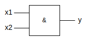
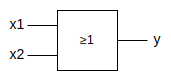
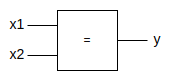

# Switching Function
 

## Table Of Contents
 

- [Switching Function](#switching-function)
  - [Table Of Contents](#table-of-contents)
  - [Definition](#definition)
  - [Operators](#operators)
    - [Basic Operators](#basic-operators)
      - [Conjunction (AND)](#conjunction-and)
      - [Disjunction (OR)](#disjunction-or)
      - [Negation (NOT)](#negation-not)
    - [Advanced Operators](#advanced-operators)
      - [NAND](#nand)
      - [NOR](#nor)
      - [Antivalence (XOR)](#antivalence-xor)
      - [Equivalence](#equivalence)
  - [Normal Forms](#normal-forms)
    - [Conjunctive (Normal) Form (CNF / CF)](#conjunctive-normal-form-cnf--cf)
    - [Disjunctive (Normal) Form (DNF / DF)](#disjunctive-normal-form-dnf--df)
    - [Example](#example)
  - [Minimization](#minimization)
  - [Vector Function](#vector-function)

 
 
 
 

## Definition

> A **switching function** is defined as $$f(x_1, x_2, ...,x_n) \in \{0,1\} \text{ with } y, x_i \in \{0,1\}.$$
>
> For $n$ input variables there are $2^{2^n}$ switching functions.

 
 
 
 

## Operators
 
 
 

### Basic Operators
 

> **Priority**  
> [Negation](#negation-not) > [Conjunction](#conjunction-and) > [Disjunction](#disjunction-or)

 
 

#### Conjunction (AND)
 

 

$f(x_1,x_2) = x_1 \land x_2$

 

|$x_1$ |$x_2$ |$f(x_1, x_2)$ |
|:----:|:----:|:------------:|
|0     |0     |0             |
|0     |1     |0             |
|1     |0     |0             |
|1     |1     |1             |

 

> **Tip**  
> The conjunction operator can be omitted for better readability.  
> $x_1 \land x_2 = x_1x_x$

 
 

#### Disjunction (OR)
 

 

$f(x_1,x_2) = x_1 \lor x_2$

 

|$x_1$ |$x_2$ |$f(x_1, x_2)$ |
|:----:|:----:|:------------:|
|0     |0     |0             |
|0     |1     |1             |
|1     |0     |1             |
|1     |1     |1             |

 
 

#### Negation (NOT)
 

 

$f(x) = \overline{x}$

 

|$x$ |$f(x)$ |
|:--:|:-----:|
|0   |1      |
|1   |0      |

 
 
 

### Advanced Operators
 
 

#### NAND
 

 

$f(x_1, x_2) = \overline{x_1 \land x_2}$

 

|$x_1$ |$x_2$ |$f(x_1, x_2)$ |
|:----:|:----:|:------------:|
|0     |0     |1             |
|0     |1     |1             |
|1     |0     |1             |
|1     |1     |0             |

 
 

#### NOR
 

 

$f(x_1, x_2) = \overline{x_1 \lor x_2}$

 

|$x_1$ |$x_2$ |$f(x_1, x_2)$ |
|:----:|:----:|:------------:|
|0     |0     |1             |
|0     |1     |0             |
|1     |0     |0             |
|1     |1     |0             |

 
 

#### Antivalence (XOR)
 

 

$$
\begin{align*}
   f(x_1, x_2) &= x_1 \not\equiv x_2 \\
               &= (x_1 \land \overline{x_2}) \lor (\overline{x_1} \land x_2)
\end{align*}
$$

 

|$x_1$ |$x_2$ |$f(x_1, x_2)$ |
|:----:|:----:|:------------:|
|0     |0     |0             |
|0     |1     |1             |
|1     |0     |1             |
|1     |1     |0             |

 
 

#### Equivalence
 

 

$$
\begin{align*}
   f(x_1, x_2) &= x_1 \equiv x_2 \\
               &= (x_1 \land x_2) \lor (\overline{x_1} \land \overline{x_2})
\end{align*}
$$

 

|$x_1$ |$x_2$ |$f(x_1, x_2)$ |
|:----:|:----:|:------------:|
|0     |0     |1             |
|0     |1     |0             |
|1     |0     |0             |
|1     |1     |1             |

 
 
 
 

## Normal Forms
 
 
 

### Conjunctive (Normal) Form (CNF / CF)

> A **max clause** is a disjunction of every (possibly negated) input variable that only returns `0` for exactly one combination of input variables.  
> 
> For a switching function with $n$ input variables there are $2^n$ different max clauses.

 

> A **conjunctive normal form (CNF)** of a switching function is a conjunction of those *max clauses* that return `0`.

 

> A **conjunctive form (CF)** of a switching function is a conjunction of *disjunction clauses* that do not contain all input variables.
 
 
 
 

### Disjunctive (Normal) Form (DNF / DF)

> A **min clause** is a conjunction of every (possibly negated) input variable that only returns `1` for exactly one combination of input variables.
>
> For a switching function with $n$ input variables there are $2^n$ different min clauses.

 

> A **disjunctive normal form** of a switching function is a disjunction of those *min clauses* that return `1`.

 

> A **disjunction form (DF)** of a switching function is a disjunction of *conjunctive clauses* that do not contain all input variables.

 
 
 

### Example

|$x_1$ |$x_2$ |$x_3$ |$f(x_1, x_2, x_3)$ |Min Clause                                                 |Max Clause                                               |
|:----:|:----:|:----:|:-----------------:|:----------------------------------------------------------|:--------------------------------------------------------|
|0     |0     |0     |1                  |$\overline{x}_1 \land \overline{x}_2 \land \overline{x}_3$ |-                                                        |
|0     |0     |1     |1                  |$\overline{x_1} \land \overline{x}_2 \land x_3$            |-                                                        |
|0     |1     |0     |0                  |-                                                          |$x_1 \lor \overline{x}_2 \lor x_3$                       |
|0     |1     |1     |0                  |-                                                          |$x_1 \lor \overline{x}_2 \lor \overline{x}_3$            |
|1     |0     |0     |0                  |-                                                          |$\overline{x}_1 \lor x_2 \lor x_3$                       |
|1     |0     |1     |1                  |$x_1 \land \overline{x}_2 \land x_3$                       |-                                                        |
|1     |1     |0     |1                  |$x_1 \land x_2 \land \overline{x}_3$                       |-                                                        |
|1     |1     |1     |0                  |-                                                          |$\overline{x}_1 \lor \overline{x}_2 \lor \overline{x}_3$ |

 

DNF:  
$f(x_1, x_2, x_3) = (\overline{x}_1 \land \overline{x}_2 \land \overline{x}_3) \lor (\overline{x_1} \land \overline{x}_2 \land x_3) \lor (x_1 \land \overline{x}_2 \land x_3) \lor (x_1 \land x_2 \land \overline{x}_3)$

 

CNF:  
$f(x_1, x_2, x_3) = (x_1 \lor \overline{x}_2 \lor x_3) \land (x_1 \lor \overline{x}_2 \lor \overline{x}_3) \land (\overline{x}_1 \lor x_2 \lor x_3) \land (\overline{x}_1 \lor \overline{x}_2 \lor \overline{x}_3)$

 
 
 
 

## Minimization

- [Minimization With KV-Diagrams](./minimization/switching_function_minimization_kv_diagram.md)
- [Quine-McCluskey Algorithm](./minimization/switching_function_minimization_quine_mccluskey.md)

 
 
 
 

## Vector Function

> A **vector** of a switching function is defined as $X = (x_1, x_2, ..., x_n)$.

 

> A **vector function** is defined as  
> $Y = F(X)$ with  
> $Y = (y_1, y_2, ... ,y_n)$ and  
> $F = (f_1, f_2, ... ,f_n)$.