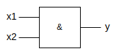
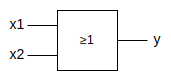
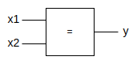

# **Switching Function**
 

## **Table Of Contents**
 

- [**Switching Function**](#switching-function)
  - [**Table Of Contents**](#table-of-contents)
  - [**Definition**](#definition)
  - [**Operators**](#operators)
    - [**Basic Operators**](#basic-operators)
      - [**Conjunction (AND)**](#conjunction-and)
      - [**Disjunction (OR)**](#disjunction-or)
      - [**Negation (NOT)**](#negation-not)
    - [**Advanced Operators**](#advanced-operators)
      - [**NAND**](#nand)
      - [**NOR**](#nor)
      - [**Antivalence (XOR)**](#antivalence-xor)
      - [**Equivalence**](#equivalence)

 
 
 
 

## **Definition**

> A **switching function** is defined as $$f(x_1, x_2, ...,x_n) \in \{0,1\} \text{ with } y, x_i \in \{0,1\}.$$
>
> For $n$ input variables there are $2^{2^n}$ switching functions.

 
 
 
 

## **Operators**
 
 
 

### **Basic Operators**
 
 

#### **Conjunction (AND)**
 

 

$f(x_1,x_2) = x_1 \land x_2$

 

|$x_1$ |$x_2$ |$f(x_1, x_2)$ |
|:----:|:----:|:------------:|
|0     |0     |0             |
|0     |1     |0             |
|1     |0     |0             |
|1     |1     |1             |

 
 

#### **Disjunction (OR)**
 

 

$f(x_1,x_2) = x_1 \lor x_2$

 

|$x_1$ |$x_2$ |$f(x_1, x_2)$ |
|:----:|:----:|:------------:|
|0     |0     |0             |
|0     |1     |1             |
|1     |0     |1             |
|1     |1     |1             |

 
 

#### **Negation (NOT)**
 

 

$f(x) = \overline{x}$

 

|$x$ |$f(x)$ |
|:--:|:-----:|
|0   |1      |
|1   |0      |

 
 
 

### **Advanced Operators**
 
 

#### **NAND**
 

 

$f(x_1, x_2) = \overline{x_1 \land x_2}$

 

|$x_1$ |$x_2$ |$f(x_1, x_2)$ |
|:----:|:----:|:------------:|
|0     |0     |1             |
|0     |1     |1             |
|1     |0     |1             |
|1     |1     |0             |

 
 

#### **NOR**
 

 

$f(x_1, x_2) = \overline{x_1 \lor x_2}$

 

|$x_1$ |$x_2$ |$f(x_1, x_2)$ |
|:----:|:----:|:------------:|
|0     |0     |1             |
|0     |1     |0             |
|1     |0     |0             |
|1     |1     |0             |

 
 

#### **Antivalence (XOR)**
 

 

$$
\begin{align*}
   f(x_1, x_2) &= x_1 \not\equiv x_2 \\
               &= (x_1 \land \overline{x_2}) \lor (\overline{x_1} \land x_2)
\end{align*}
$$

 

|$x_1$ |$x_2$ |$f(x_1, x_2)$ |
|:----:|:----:|:------------:|
|0     |0     |0             |
|0     |1     |1             |
|1     |0     |1             |
|1     |1     |0             |

 
 

#### **Equivalence**
 

 

$$
\begin{align*}
   f(x_1, x_2) &= x_1 \equiv x_2 \\
               &= (x_1 \land x_2) \lor (\overline{x_1} \land \overline{x_2})
\end{align*}
$$

 

|$x_1$ |$x_2$ |$f(x_1, x_2)$ |
|:----:|:----:|:------------:|
|0     |0     |1             |
|0     |1     |0             |
|1     |0     |0             |
|1     |1     |1             |
