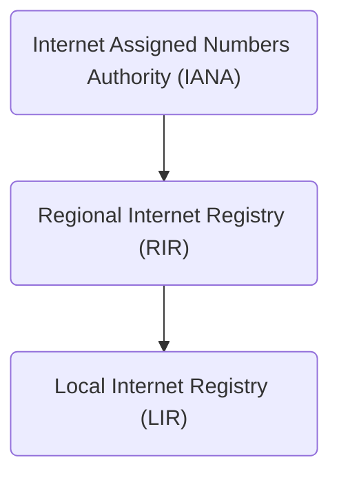
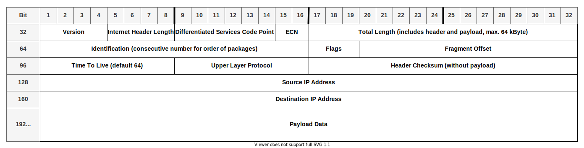

# **IPv4 Basics**
<br>

## **Table Of Contents**
<br>

- [**IPv4 Basics**](#ipv4-basics)
  - [**Table Of Contents**](#table-of-contents)
  - [**General**](#general)
  - [**IP Address**](#ip-address)
    - [**Network Classes**](#network-classes)
    - [**Classless Inter Domain Routing (CIDR)**](#classless-inter-domain-routing-cidr)
    - [**Subnet mask**](#subnet-mask)
    - [**Private IPv4 Adress Ranges**](#private-ipv4-adress-ranges)
    - [**Loopback Address Range**](#loopback-address-range)
    - [**Authorities For Assigning IP Addresses**](#authorities-for-assigning-ip-addresses)
  - [**IP Header**](#ip-header)

<br>
<br>
<br>

## **General**
<br>

The Internet Protocol (IP) is a layer 3 (network layer) protocol.

It is used for:
* network identification
* logical location addressing
* enabling connections between different network segments

<br>

There are two versions:

* IPv4 (discussed here)
* [IPv6](../IPv6/IPv6_basics.md)

<br>
<br>
<br>

## **IP Address**
<br>

* length: 32 Bit (4 x 8 Bit)
* must be unique within a network
* each octet is in the range of decimal values 0 to 255
* can be split into a **network part** and a **host part** 

<br>

Example
```
192.168.0.23
```

<br>
<br>

### **Network Classes**
<br>

* historical method of splitting ip address ranges
* replaced by Classless Inter-Domain Routing (CIDR), but still has influence in certain topics
* first four bits of leading octet were used for class address

<br>

|Class |Ip Range                       |first octet |Netmask         |Host addresses |
|:----:|:------------------------------|:-----------|:---------------|--------------:|
|A     |0.0.0.0   - 127.255.255.255    |00000000    |255.0.0.0       |16,777,214     |
|B     |128.0.0.0 - 191.255.255.255    |10000000    |255.255.0.0     |65,534         |
|C     |192.0.0.0 - 223.255.255.255    |11000000    |255.255.255.0   |254            |

<br>
<br>

### **Classless Inter Domain Routing (CIDR)**
<br>

* replacement for network classes
* introduced splitting ip addresses in network part and host part
* based on variable-length subnet masking (VLSM)
* introduced CIDR notation: /x for x amount of bits in network part of subnet mask

<br>
<br>

### **Subnet mask**
<br>

* defines the network part of an ip address
* length: 32 Bit (4 x 8 Bit)
* sequence of `1`s followed by a block of `0s`
    * `1`s represent network part
    * `0`s represent host part

<br>

|Subnet mask                         |Decimal         |CIDR Notation |Total addresses |
|:-----------------------------------|:---------------|:------------:|---------------:|
|11111111.00000000.00000000.00000000 |255.0.0.0       |/8            |16.777.214      |
|11111111.10000000.00000000.00000000 |255.128.0.0     |/9            |8.388.608       |
|11111111.11000000.00000000.00000000 |255.192.0.0     |/10           |4.194.304       |
|11111111.11100000.00000000.00000000 |255. 224.0.0     |/11           |2.097.152       |
|11111111.11110000.00000000.00000000 |255.240.0.0     |/12           |1.048.576       |
|11111111.11111000.00000000.00000000 |255.248.0.0     |/13           |524.288         |
|11111111.11111100.00000000.00000000 |255.252.0.0     |/14           |262.144         |
|11111111.11111110.00000000.00000000 |255.254.0.0     |/15           |131.072         |
|11111111.11111111.00000000.00000000 |255.255.0.0     |/16           |65.536          |
|11111111.11111111.10000000.00000000 |255.255.128.0   |/17           |32.768          |
|11111111.11111111.11000000.00000000 |255.255.192.0   |/18           |16.384          |
|11111111.11111111.11100000.00000000 |255.255.224.0   |/19           |8.192           |
|11111111.11111111.11110000.00000000 |255.255.240.0   |/20           |4.096           |
|11111111.11111111.11111000.00000000 |255.255.248.0   |/21           |2.048           |
|11111111.11111111.11111100.00000000 |255.255.252.0   |/22           |1.024           |
|11111111.11111111.11111110.00000000 |255.255.254.0   |/23           |512             |
|11111111.11111111.11111111.00000000 |255.255.255.0   |/24           |256             |
|11111111.11111111.11111111.10000000 |255.255.255.128 |/25           |128             |
|11111111.11111111.11111111.11000000 |255.255.255.192 |/26           |64              |
|11111111.11111111.11111111.11100000 |255.255.255.224 |/27           |32              |
|11111111.11111111.11111111.11110000 |255.255.255.240 |/28           |16              |
|11111111.11111111.11111111.11111000 |255.255.255.248 |/29           |8               |
|11111111.11111111.11111111.11111100 |255.255.255.252 |/30           |4               |
|11111111.11111111.11111111.11111110 |255.255.255.254 |/31           |2               |
|11111111.11111111.11111111.11111111 |255.255.255.255 |/32           |0               |

<br>
<br>

### **Private IPv4 Adress Ranges**
<br>

* used for private (= not connected to the public internet) networks
* addresses in these ranges are not redirected to the public internet

|IPv4 Address Range            |Netmask |Number of networks |Number of addresses per net |
|:-----------------------------|:------:|:------------------|:---------------------------|
|10.0.0.0    - 10.255.255.255  |/8      |1                  |16,777,216                  |
|172.16.0.0  - 172.31.255.255  |/16     |16                 |65,536                      |
|192.168.0.0 - 192.168.255.255 |/24     |256                |256                         | 

<br>
<br>

### **Loopback Address Range**
<br>

```
127.0.0.0 - 127.255.255.255
```

* localnet / localhost
* addresses in this range are pointing back to the host
  * enables host to send data to itself

<br>
<br>

### **Authorities For Assigning IP Addresses**
<br>



<br>
<br>
<br>

## **IP Header**
<br>



<br>

|Field                                  |Description
|:--------------------------------------|:----------
|Differentiated Services Code Point     |settings for quality of service 
|Explicit Congestion Notification (ECN) |setting for notification of network congestion without package dropping
|Flags                                  |setting for allowing fragmentation by routers 
|Time To Live                           |number of hops to routers before packet is deleted to prevent routing loops