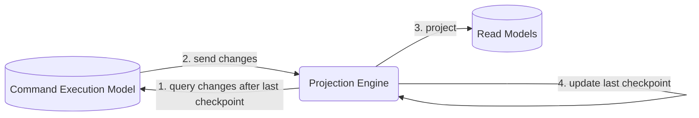
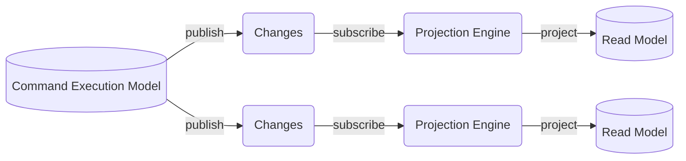

# **Command Query Responsibility Segregation (CQRS)**
 

## **Table Of Contents**

- [**Command Query Responsibility Segregation (CQRS)**](#command-query-responsibility-segregation-cqrs)
  - [**Table Of Contents**](#table-of-contents)
  - [**Definition**](#definition)
  - [**Command Execution Model**](#command-execution-model)
  - [**Read Models**](#read-models)
  - [**Polyglot Persistance Model**](#polyglot-persistance-model)
  - [**Projections**](#projections)
    - [**Synchronous Projection**](#synchronous-projection)
    - [**Asynchronous Projection**](#asynchronous-projection)
  - [**When To Use**](#when-to-use)

 
 
 
 

## **Definition**

> The **command query responsibility segregation** (CQRS) divides the models of the system into a [command execution model](#command-execution-model) and multiple [read models](#read-models).

 

 
 
 
 

## **Command Execution Model**

> The **command execution model** implements the business logic and contains only strictly consistent data.  
> It is the source of truth and can modify the system state by executing commands.

 

> **NOTE**: Executed commands is allowed to return data to the initiator!

 
 
 
 

## **Read Models**

> The **read models** are cached projections of the system data that are used for specific users or purposes. They are read-only,

 
 
 
 

## **Polyglot Persistance Model**

> In a **polyglot persistence model** we use multiple different database types to fulfill the system requirements for the data.

 
 
 
 

## **Projections**
 
 

### **Synchronous Projection**

 
 

### **Asynchronous Projection**

 
 
 
 

## **When To Use**

We use CQRS when our system has to work on multiple models that share the same data.