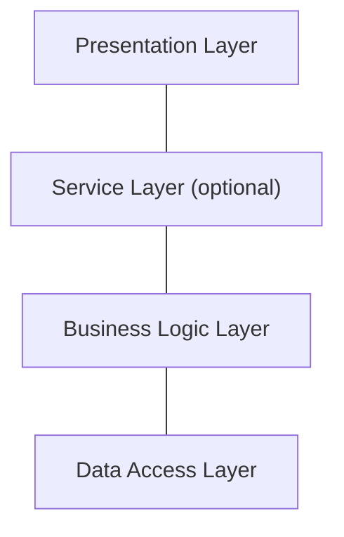

# **Layered Architecture**
 

## **Table Of Contents**

- [**Layered Architecture**](#layered-architecture)
  - [**Table Of Contents**](#table-of-contents)
  - [**Definition**](#definition)
  - [**Layers**](#layers)
    - [**Presentation Layer**](#presentation-layer)
    - [**Service Layer (optional)**](#service-layer-optional)
    - [**Business Logic Layer**](#business-logic-layer)
    - [**Data Access Layer**](#data-access-layer)
  - [**When To Use**](#when-to-use)

 
 
 
 

## **Definition**

> The **layered architecture** organizes a system in horizontal logical layers.  
> Each layer
> - implements functionalities for the layer above and
> - uses functionalities of the layer beneath.

 

 
 
 
 

## **Layers**
 
 

### **Presentation Layer**

> The **presentation layer** implements the interactions with the user.  
> It can contain
> - graphical user interfaces
> - command line interfaces
> - APIs for interacting with other systems
> - message broker

 
 
 

### **Service Layer (optional)**

> The **service layer** is a [facade](../DesignPatterns/StructuralPatterns/facade.md) for the business logic layer that encapsulates the orchestration of the actions requested by the presentation layer

 
 
 

### **Business Logic Layer**

> The **business logic layer** contains all components, rules and invariants of the business logic.

 
 
 

### **Data Access Layer**

> The **data access layer** persists the data of the system and implements access to the data of other systems.  
> 
> It can use multiple mechanisms like
> - relational databases
> - document stores
> - in-memory databases
> - cloud storage

 
 
 
 

## **When To Use**

When the business logic is implemented with [transaction scripts](../../DomainDrivenDesign/tacticalDesign/simpleBusinessLogic/ddd-transaction-script.md) and [active records](../../DomainDrivenDesign/tacticalDesign/simpleBusinessLogic/ddd-active-record.md).