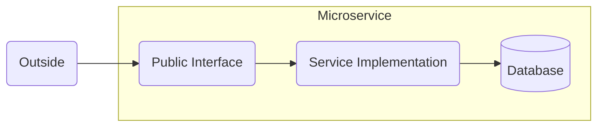

# **Microservice Architecture**
 

## **Table Of Contents**

- [**Microservice Architecture**](#microservice-architecture)
  - [**Table Of Contents**](#table-of-contents)
  - [**Microservice**](#microservice)
  - [**Advantages**](#advantages)

 
 
 
 

## **Microservice**
 

> A **microservice** is a [service](../../../glossary.md#service) with physical boundaries.  
> It offers a small public interface to the outside and exclusively operates on its database.

 
 

 
 
 
 

## **Advantages**
 

- Scalability
- Easy to understand and integrate
- Lower frequency of necessary changes
