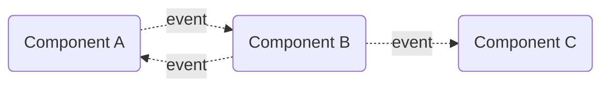
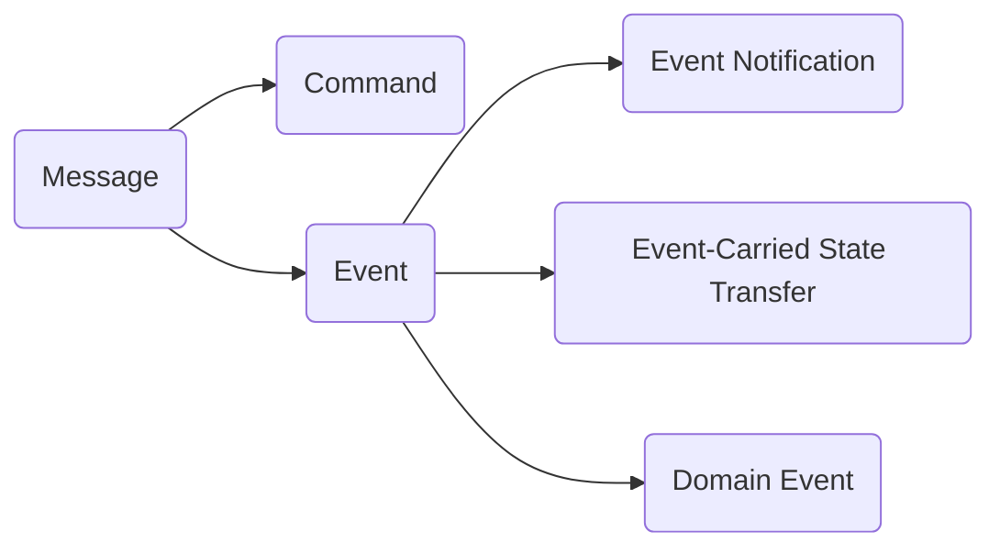
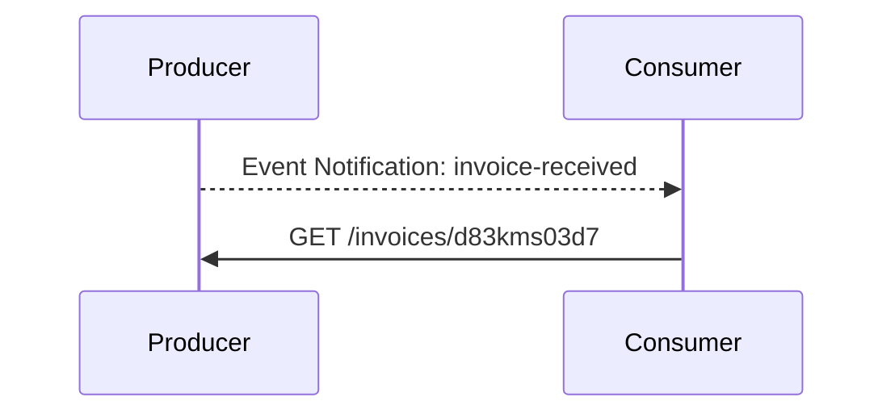

# **Event-Driven Architecture**
<br>

## **Table Of Contents**

- [**Event-Driven Architecture**](#event-driven-architecture)
  - [**Table Of Contents**](#table-of-contents)
  - [**What is an event?**](#what-is-an-event)
  - [**Definition Event-Driver Architecture**](#definition-event-driver-architecture)
  - [**Message Types**](#message-types)
    - [**Command**](#command)
    - [**Event**](#event)
      - [**Event Notification**](#event-notification)
      - [**Event-Carried State Transfer (ECST)**](#event-carried-state-transfer-ecst)
      - [**Domain Event**](#domain-event)
  - [**Design Heuristics**](#design-heuristics)
    - [**Be Pessimistic About Message Delivery**](#be-pessimistic-about-message-delivery)
    - [**Do Not Expose Implementation Details**](#do-not-expose-implementation-details)

<br>
<br>
<br>
<br>

## **What is an event?**
<br>

> An **event** is a data record that can be [serialized](../../../glossary.md#serialization) and transmitted.  
> It typically contains metadata and a payload.

<br>
Example:

```javascript
{
   id: 'ks7sdw9t678ew',
   type: 'invoice-received',
   timestamp: 1712408140806,
   payload: {
      invoiceId: 'd83kms03d7'
   }
}
```

<br>
<br>
<br>
<br>

## **Definition Event-Driver Architecture**
<br>

> In an **event-driven architecture** the components of a system communicate asynchronously by exchanging event messages.  
> 
> Components publish events and can subscribe to the events of other components.

<br>



<br>
<br>
<br>
<br>

## **Message Types**
<br>



<br>
<br>
<br>

### **Command**
<br>

> A **command message** instructs the receiver to perform a specified operation.  
> The receiver can reject the execution.

<br>
<br>
<br>

### **Event**
<br>

> An **event** describes an already occurred change.

<br>
<br>

#### **Event Notification**
<br>

> An **event notification** informs the subscribers about a change in the producer´s domain so they can react to it.  
> 
> It is only used to communicate with other components and should only include minimal information.

<br>

Example:

```javascript
{
   id: 'ks7sdw9t678ew',
   type: 'invoice-received',
   timestamp: 1712408140806,
   payload: {
      invoiceId: 'd83kms03d7',
      link: '/invoices/d83kms03d7'
   }
}
```

The subscribers are informed that an invoice with id `d83kms03d7` was received.  
If the subscriber needs additional information to react to this event it can query details at `/invoices/d83kms03d7`.



<br>
<br>

#### **Event-Carried State Transfer (ECST)**
<br>

> An **event-carried state transfer** informs the subscribers about a change in the producer´s domain so they can react to it.  
> 
> In contrast to the [event notification](#event-notification) it contains all data about the change.  

<br>

This asynchronous data replication allows the subscriber to have a local cache of the producer´s current state. This increases the reliability of the system.

<br>
<br>

#### **Domain Event**
<br>

> A **domain event** informs the subscribers about a change in the producer´s domain so they can react to it.  
> 
> It contains all data about the change and can also be used within the domain itself.

<br>
<br>
<br>
<br>

## **Design Heuristics**
<br>
<br>

### **Be Pessimistic About Message Delivery**

Always assume there will be problems with message delivery like
- event duplicates
- events arrive in the wrong order
- events are delayed
- events do not arrive

<br>

Therefore use
- [Outbox Pattern](../../DomainDrivenDesign/tacticalDesign/ddd-aggregate-communication.md#outbox-pattern)
- [Saga Pattern](../../DomainDrivenDesign/tacticalDesign/ddd-aggregate-communication.md#saga-pattern)
- [Process Manager Pattern](../../DomainDrivenDesign/tacticalDesign/ddd-aggregate-communication.md#process-manager-pattern)

<br>
<br>

### **Do Not Expose Implementation Details**

Use private events to communicate within modules.

Use public events of the appropriate types when communicating with the outside.