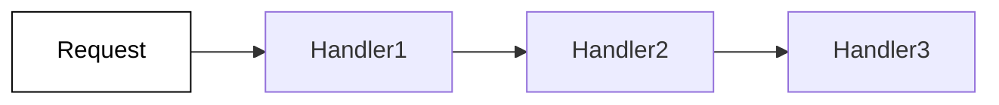

# **Chain Of Responsibility**
<br>

## **Table Of Contents**
<br>

- [**Chain Of Responsibility**](#chain-of-responsibility)
  - [**Table Of Contents**](#table-of-contents)
  - [**Intent**](#intent)
  - [**Core Ideas**](#core-ideas)
  - [**Structure**](#structure)
  - [**Use Cases**](#use-cases)
  - [**Consequences**](#consequences)
  - [**Implementation Tips**](#implementation-tips)
  - [**Example**](#example)
    - [**Request**](#request)
    - [**Handler Interface**](#handler-interface)
    - [**Handler Implementation**](#handler-implementation)
    - [**Client**](#client)

<br>
<br>
<br>
<br>

## **Intent**

Process a request by passing a request object along a chain of handler objects.

<br>



<br>
<br>
<br>
<br>

## **Core Ideas**

- Request is passed as a mutable object along a chain of handlers
- A handler handles the request if it is responsible for it
- Each handler can either
  - pass the request object to the next handler **or**
  - stop the chain

<br>
<br>
<br>
<br>

## **Structure**


<br>
<br>
<br>
<br>

## **Use Cases**

- We want to dynamically process different request types in various ways
- We want the exectue handlers in a specific order

<br>
<br>
<br>
<br>

## **Consequences**
<br>

|**Advantages**                                                          |**Disadvantages** |
|:-----------------------------------------------------------------------|:-----------------|
|Control over the execution order of the handlers                        |                  |
|Reduces the coupling between the request object and the handler objects |                  |

<br>
<br>
<br>
<br>

## **Implementation Tips**

- Declare a common interface for the handler objects

<br>
<br>
<br>
<br>

## **Example**
<br>
<br>
<br>

### **Request**

```typescript
class Request {
  private payload: string;

  constructor(payload: string) {
    this.payload = payload;
  }

  set payload(payload: string) {
    this.payload = payload;
  }

  get payload(): string {
    return this.payload;
  }
}
```

<br>
<br>
<br>

### **Handler Interface**

```typescript
abstract class Handler {
  private successor: Handler;

  constructor() {}

  setSuccessor(successor: Handler) {
    this.successor = successor;
  }

  abstract execute(request: Request): void;
}
```

<br>
<br>
<br>

### **Handler Implementation**

```typescript
class PayloadModifier extends Handler {
  execute(request: Request): {
    const modifiedPayload = `${request.payload} (modified)`;
    request.payload = modifiedPayload;
    this.successor.execute(request);
  }
}
```

<br>

```typescript
class ChainAborter extends Handler {
  execute(request: Request): {
    const requestModified = request.payload.includes('modified');
    if (requestModified) {
      // stop the processing chain by not passing the request object 
    } else {
      this.successor.execute(request);
    }
  }
}
```

<br>
<br>
<br>

### **Client**

```typescript
const handler1 = new PayloadModifier();
const handler2 = new ChainAborter(); 
const handler3 = new PayloadModifier();

handler1.setSuccessor(handler2);
handler2.setSuccessor(handler3);

const handlerChain = handler1;

const request = new Request('payload');

handlerChain.execute(request);
```