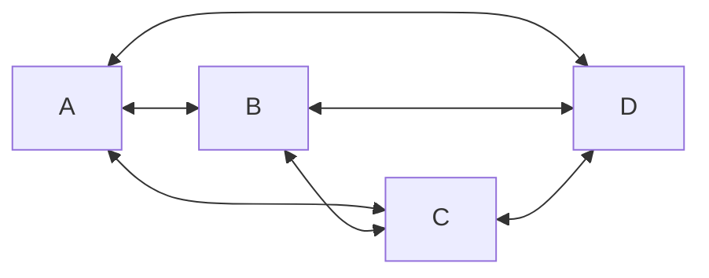
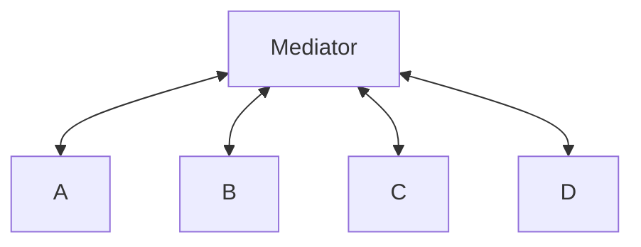

# **Mediator**
<br>

## **Table Of Contents**
<br>

- [**Mediator**](#mediator)
  - [**Table Of Contents**](#table-of-contents)
  - [**Intent**](#intent)
  - [**Core Ideas**](#core-ideas)
  - [**Structure**](#structure)
  - [**Use Cases**](#use-cases)
  - [**Consequences**](#consequences)
  - [**Implementation Tips**](#implementation-tips)
  - [**Example**](#example)
    - [**Components**](#components)
    - [**Mediator**](#mediator-1)

<br>
<br>
<br>
<br>

## **Intent**

Encapsulate the interaction between various objects.

<br>

Before:



<br>

After:



<br>
<br>
<br>
<br>

## **Core Ideas**

- Objects only communicate via the *mediator* object with each other

<br>
<br>
<br>
<br>

## **Structure**


<br>
<br>
<br>
<br>

## **Use Cases**

- When there are a lot of dependencies between the objects (*strong coupling*)
- When there are complex interactions between the objects

<br>
<br>
<br>
<br>

## **Consequences**
<br>

|**Advantages** |**Disadvantages** |
|:--------------|:-----------------|
|Weakens coupling between objects |Danger of creating a god object |

<br>
<br>
<br>
<br>

## **Implementation Tips**

\-

<br>
<br>
<br>
<br>

## **Example**
<br>
<br>
<br>

### **Components**

```typescript
class ComponentA {
  private mediator: Mediator;

  constructor(mediator: Mediator) {
    this.mediator = mediator;
  }

  public answerRequest() {
    return 'answerFromA';
  }

  public communicateWithB() {
    return this.mediator.requestB();
  }

  public communicateWithC() {
    return this.mediator.requestC();
  }
}
```

<br>

```typescript
class ComponentB {
  private mediator: Mediator;

  constructor(mediator: Mediator) {
    this.mediator = mediator;
  }

  public answerRequest() {
    return 'answerFromB';
  }

  public communicateWithA() {
    return this.mediator.requestA();
  }

  public communicateWithC() {
    return this.mediator.requestC();
  }
}
```

<br>

```typescript
class ComponentC {
  private mediator: Mediator;

  constructor(mediator: Mediator) {
    this.mediator = mediator;
  }

  public answerRequest() {
    return 'answerFromC';
  }

  public communicateWithA() {
    return this.mediator.requestA();
  }

  public communicateWithB() {
    return this.mediator.requestB();
  }
}
```

<br>
<br>
<br>

### **Mediator**

```typescript
class Mediator {
  private componentA: ComponentA;
  private componentB: ComponentB;
  private componentC: ComponentC;

  constructor() {
    this.componentA = new ComponentA();
    this.componentB = new ComponentB();
    this.componentC = new ComponentC();
  }

  public requestA(): string {
    this.componentA.answerRequest();
  }

  public requestB(): string {
    this.componentB.answerRequest();
  }

  public requestC(): string {
    this.componentC.answerRequest();
  }
}
```