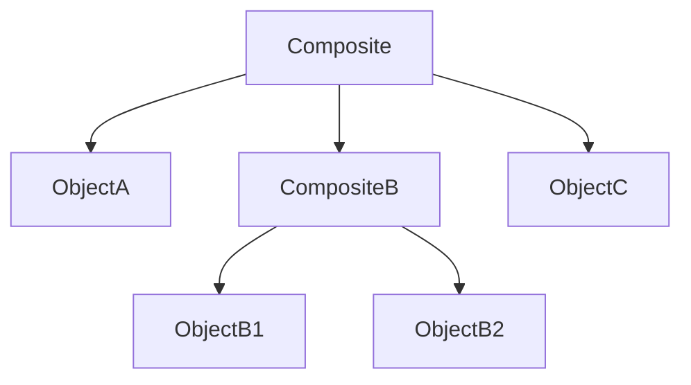

# **Composite**
<br>

## **Table Of Contents**
<br>

- [**Composite**](#composite)
  - [**Table Of Contents**](#table-of-contents)
  - [**Intent**](#intent)
  - [**Core Ideas**](#core-ideas)
  - [**Structure**](#structure)
  - [**Use Cases**](#use-cases)
  - [**Consequences**](#consequences)
  - [**Implementation Tips**](#implementation-tips)
  - [**Example**](#example)
    - [**Component**](#component)
    - [**Leaf**](#leaf)
    - [**Composite**](#composite-1)

<br>
<br>
<br>
<br>

## **Intent**

Compose objects into tree structures and allow composites of multiple objects to be treated as single objects.

<br>



<br>
<br>
<br>
<br>

## **Core Ideas**

- Objects can hold references to other objects
- Objects and composites implement the same interface so that composites can be treated like objects

<br>
<br>
<br>
<br>

## **Structure**


<br>
<br>
<br>
<br>

## **Use Cases**

- When the core model can be represented as a tree.
- When we need to perform certain actions on both objects and composites

<br>
<br>
<br>
<br>

## **Consequences**

|**Advantages** |**Disadvantages** |
|:--------------|:-----------------|
|*Composites* and *leafs* can be treated the same |Extraction of the *component* interface may be difficult |
|Easy extension with additional component types | |

<br>
<br>
<br>
<br>

## **Implementation Tips**

- *Composites* coordinate and delegate tasks to their connected *leafs* or *subcomposites*

<br>
<br>
<br>
<br>

## **Example**
<br>
<br>

### **Component**

```typescript
interface Component {
  calculatePrice(): number;
}
```

<br>
<br>
<br>

### **Leaf**

```typescript
class Product implements Component {
  private priceBeforeTax: number;
  private taxInPercent: number;

  constructor(priceBeforeTax: number, taxInPercent: number) {
    this.priceBeforeTax = priceBeforeTax;
    this.taxInPercent = taxInPercent;
  }

  calculatePrice(): number {
    return priceBeforeTax * (1 + (taxInPercent / 100));
  }
}
```

<br>
<br>
<br>

### **Composite**

```typescript
class Package implements Component {
  private children: Components[];
  private price: number;

  addChild(component: Component): void {
    this.children.push(component);
  }

  getChildren(): Component[] {
    return children;
  }

  removeChild(component: Component): void {
    this.children = this.children.filter(
      child => child !== component
    );
  }

  calculatePrice(): number {
    let total = this.price;
    for (const child of this.children) {
      total += child.calculatePrice();
    }
    return total;
  }
}
```