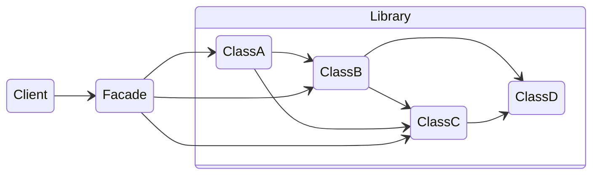

# **Facade**
<br>

## **Table Of Contents**
<br>

- [**Facade**](#facade)
  - [**Table Of Contents**](#table-of-contents)
  - [**Intent**](#intent)
  - [**Core Ideas**](#core-ideas)
  - [**Structure**](#structure)
  - [**Use Cases**](#use-cases)
  - [**Consequences**](#consequences)
  - [**Implementation Tips**](#implementation-tips)
  - [**Example**](#example)

<br>
<br>
<br>
<br>

## **Intent**

A facade provides a central high-level interface to use a complex subsystem like a library.

<br>



<br>
<br>
<br>
<br>

## **Core Ideas**

- Bundle interaction with a complex subsystem in a facade object
- Implement high level functionality for the client

<br>
<br>
<br>
<br>

## **Structure**


<br>
<br>
<br>
<br>

## **Use Cases**

- We want to to implement a single high-level point of interaction with a complex library or set of classes

<br>
<br>
<br>
<br>

## **Consequences**
<br>

|**Advantages** |**Disadvantages** |
|:--------------|:-----------------|
|Encapsulates complexity of the subsystem usage |Danger of creating a god object |
|Weakens coupling between the system and the subsystem | |

<br>
<br>
<br>
<br>

## **Implementation Tips**

\-

<br>
<br>
<br>
<br>

## **Example**

```typescript
class Facade {
  protected subsystem: Subsystem;

  constructor(subsystem: Subsystem) {
    this.subsystem = subsystem;
  }

  public highLevelInteraction() {
    this.subsystem.initialize();
    let result = this.subsystem.operationA();
    result = this.subsystem.operationB();
    result = this.subsystem.operationC();
    result = this.subsystem.operationD();
    result = this.subsystem.operationE();
    return result;
  }
}
```