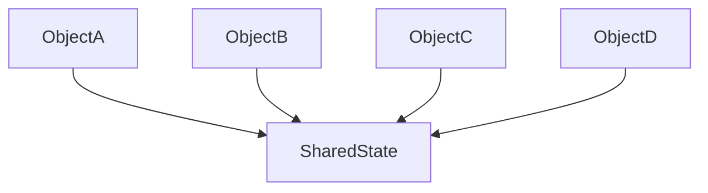

# **Flyweight**
<br>

## **Table Of Contents**
<br>

- [**Flyweight**](#flyweight)
  - [**Table Of Contents**](#table-of-contents)
  - [**Intent**](#intent)
  - [**Core Ideas**](#core-ideas)
  - [**Structure**](#structure)
  - [**Use Cases**](#use-cases)
  - [**Consequences**](#consequences)
  - [**Implementation Tips**](#implementation-tips)
  - [**Example**](#example)

<br>
<br>
<br>
<br>

## **Intent**

Share common parts of state between multiple objects.

<br>



<br>
<br>
<br>
<br>

## **Core Ideas**

- Model state that should be shared between multiple objects as a separate object
- Objects holding a shared state should be immutable

<br>
<br>
<br>
<br>

## **Structure**


<br>
<br>
<br>
<br>

## **Use Cases**

- We use a huge amount of objects that require a lot of storage
- The application behavior does not rely on the object identity

<br>
<br>
<br>
<br>

## **Consequences**
<br>

|**Advantages**       |**Disadvantages**     |
|:--------------------|:---------------------|
|Reduced memory usage |More complicated code |

<br>
<br>
<br>
<br>

## **Implementation Tips**

\-

<br>
<br>
<br>
<br>

## **Example**

```typescript
class Flyweight {
  private sharedState: any;

  constructor(sharedState: any) {
    this.sharedState = sharedState;
  }

  get sharedState(): any {
    return sharedState;
  }
}
```