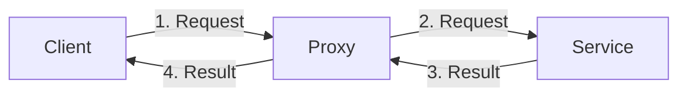

# **Proxy**
<br>

## **Table Of Contents**
<br>

- [**Proxy**](#proxy)
  - [**Table Of Contents**](#table-of-contents)
  - [**Intent**](#intent)
  - [**Core Ideas**](#core-ideas)
  - [**Structure**](#structure)
  - [**Use Cases**](#use-cases)
  - [**Consequences**](#consequences)
  - [**Implementation Tips**](#implementation-tips)
  - [**Example**](#example)
    - [**Service Interface**](#service-interface)
    - [**Service**](#service)
    - [**Proxy**](#proxy-1)
    - [**Client**](#client)

<br>
<br>
<br>
<br>

## **Intent**

A proxy is a placeholder for a service object  that controls the interaction between a client and the service.

<br>



<br>
<br>
<br>
<br>

## **Core Ideas**

- Proxy takes care of the actual interaction with the service object
- Proxy can implement additional behavior before or after the interaction with the service object

<br>
<br>
<br>
<br>

## **Structure**


<br>
<br>
<br>
<br>

## **Use Cases**

- **Virtual** proxy: controls lifetime of  expensive object
- **Remote** proxy: local placeholder for communicating with a remote system
- **Protection** proxy: controls which client gets access to the object 
- **Logging** proxy: keeps a log of request history
- **Cache** proxy: chache results of client requests
- **Smart Reference**: Destroy expensive object when it is not being used

<br>
<br>
<br>
<br>

## **Consequences**
<br>

|**Advantages**              |**Disadvantages** |
|:---------------------------|:-----------------|
|Ability to manage lifecycle |Introduction of additional classes |

<br>
<br>
<br>
<br>

## **Implementation Tips**

\-

<br>
<br>
<br>
<br>

## **Example**
<br>
<br>

### **Service Interface**

```typescript
interface ServiceInterface {
  requestA(): string;
  requestB(): number;
}
```

<br>
<br>
<br>

### **Service**

```typescript
class Service implements ServiceInterface {
  requestA() {
    return 'result of request A';
  }
  
  requestB() {
    return 34;
  }
}
```

<br>
<br>
<br>

### **Proxy**

```typescript
class Proxy implements ServiceInterface {
  private service: Service;

  constructor() {
    this.service = new Service();
  }

  requestA() {
    // actions before request
    const result = service.requestA();
    // actions after request
    return result;
  }

  requestB() {
    // actions before request
    const result = service.requestB();
    // actions after request
    return result;
  }
}
```

<br>
<br>
<br>

### **Client**

```typescript
class Client {
  private service: Service;

  constructor(service: Service) {
    this.service = service;
  }

  someMethod() {
    const resultA = this.service.requestA();
    const resultB = this.service.requestB();
    return `(${resultA}, ${resultB})`;
  }
}
```

<br>

```typescript
const client = new Client(new Proxy());
client.someMethod();
```