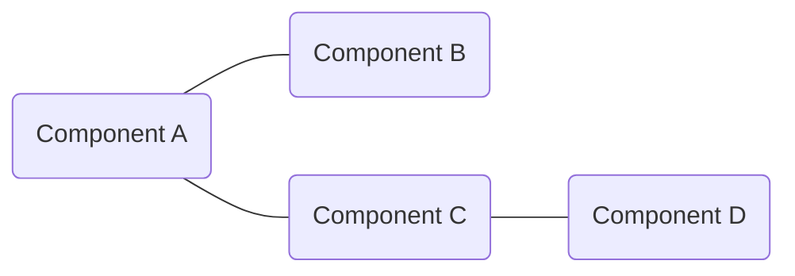
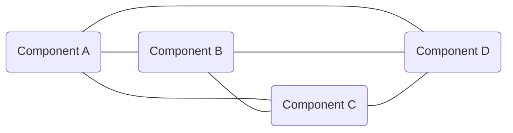
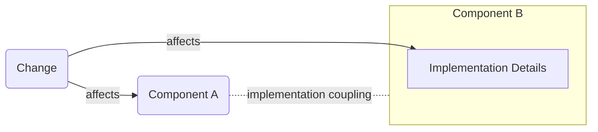
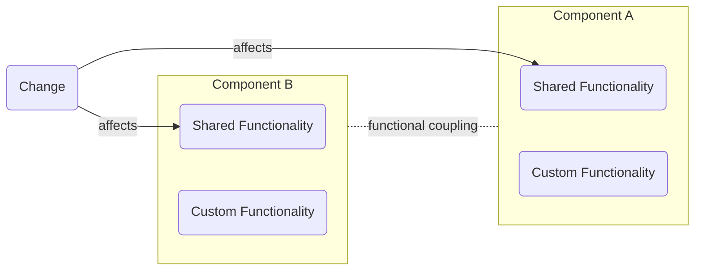
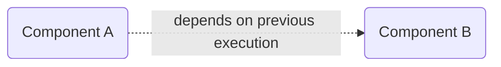

# **Coupling**
 

## **Table Of Contents**

- [**Coupling**](#coupling)
  - [**Table Of Contents**](#table-of-contents)
  - [**What is coupling?**](#what-is-coupling)
  - [**Coupling Types**](#coupling-types)
    - [**Implementation Coupling**](#implementation-coupling)
    - [**Functional Coupling**](#functional-coupling)
    - [**Time Coupling**](#time-coupling)

 
 
 
 

## **What is coupling?**

> **Coupling** describes the degree of interdependence between different components in a system.

 

**Good:** Weak Coupling

 
 

**Bad:** Strong Coupling

 
 
 
 

## **Coupling Types**
 
 
 

### **Implementation Coupling**

> **Implementation coupling** describes that a component relies on implementation details of another component and is affected by changes to it.

 

 
 
 

### **Functional Coupling**

> **Functional coupling** describes that multiple components contain the same functionality and are therefore affected by changes to this functionality.

 

 
 
 

### **Time Coupling**

> **Time coupling** describes that component A depends on the *previous* execution of component B.  
>
> In other words there is a specific order of execution.

 

