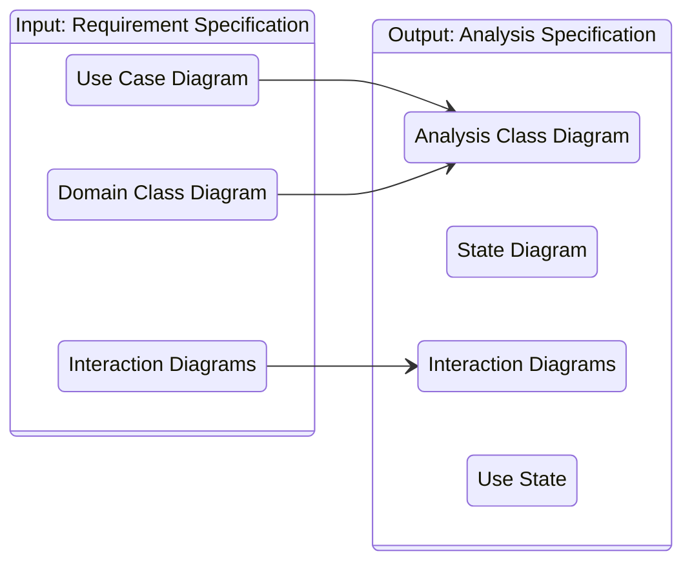
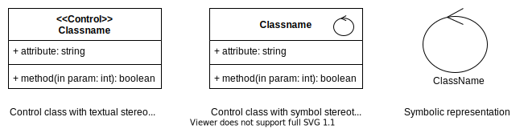

# **Analysis**
 

## **Table Of Contents**
 

- [**Analysis**](#analysis)
  - [**Table Of Contents**](#table-of-contents)
  - [**Overview**](#overview)
  - [**Analysis Class Diagram**](#analysis-class-diagram)
    - [**Basis**](#basis)
    - [**Goal**](#goal)
    - [**Analysis Classes**](#analysis-classes)
      - [**Entity Classes**](#entity-classes)
      - [**Control Classes**](#control-classes)
      - [**Boundary Class**](#boundary-class)
        - [**Actor-UseCase Boundary Class**](#actor-usecase-boundary-class)
        - [**Actor-All-UseCase Boundary Class**](#actor-all-usecase-boundary-class)
    - [**Create Analysis Class Diagram**](#create-analysis-class-diagram)
      - [**1. Unite domain class diagram with use case diagram**](#1-unite-domain-class-diagram-with-use-case-diagram)
      - [**2. Add operations to the analysis class diagram**](#2-add-operations-to-the-analysis-class-diagram)
      - [**3. Rework and clean analysis classes with heuristics**](#3-rework-and-clean-analysis-classes-with-heuristics)
        - [**1-1 relationship between two classes**](#1-1-relationship-between-two-classes)
        - [**Generalization**](#generalization)
      - [**4. Divide analysis classes into packages**](#4-divide-analysis-classes-into-packages)

 
 
 
 

## **Overview**

The analysis is based on the [requirement specification](./requirements_engineering.md#goal-requirement-specification). 

The main goal of the analysis is to translate the domain class diagram to the more detailed analysis class diagram.  

The analysis class diagram is part of the analysis specification which will act as the basis of the implementation.

 

 
 
 
 

## **Analysis Class Diagram**
 
 
 

### **Basis**

The analysis class diagram is based on the
1. [domain class diagram](./requirements_engineering.md#create-a-domain-class-diagram)
2. [use case diagram](./requirements_engineering.md#create-a-use-case-diagram) (and its textual specification)

 
 
 

### **Goal**

The goal of the analysis class diagram is to
1. unite the [domain class diagram](./requirements_engineering.md#create-a-domain-class-diagram) and the [use case diagram](./requirements_engineering.md#create-a-use-case-diagram)
2. rework the [domain class diagram](./requirements_engineering.md#create-a-domain-class-diagram) and add details
3. verify that the diagram is complete and consistent

 
 
 

### **Analysis Classes**

Analysis classes still focus on the functional requirements and the domain, **not** on the implementation in a specific programming language.  

Signatures are only specified precisely for complex non-standard methods.

Compared to the domain classes they are more detailed and closer to the implementation.

 
 

#### **Entity Classes**

> An entity class describes a specific entity of the domain.  
Instances are typically long-lived and hold a large chunk of information.

 
 

#### **Control Classes**

> A control class manages the flow of interactions between the entity classes and boundary classes within a specific scenario.

 

 
 

#### **Boundary Class**

> A **boundary class** encapsulates the interactions between a specific actor and the system.  
> It is typically located on the periphery of the system or a subsystem.

 

 
 

##### **Actor-UseCase Boundary Class**

An actor-usecase boundary class models the interaction between a specific actor and a specific use case.

> **Attention:**  Actor-UseCase boundary classes are suffixed with **AAS**!

 
 

##### **Actor-All-UseCase Boundary Class**

An actor-all-usecases boundary class models the interaction of a specific actor with **all** of his use cases. 

 

> **Attention:** Actor-All-UseCases boundary classes are suffixed with **AS**!

 
 
 

### **Create Analysis Class Diagram**
 
 

#### **1. Unite domain class diagram with use case diagram**

We create the first version of the analysis class diagram by uniting the [domain class diagram](./requirements_engineering.md#create-a-domain-class-diagram) and the [use case diagram](./requirements_engineering.md#create-a-use-case-diagram). We can also add additional classes.

 
 

#### **2. Add operations to the analysis class diagram**

We add operations to the analysis class diagram.

 

> **Attention:** Do not add standard operations like getters or setters to the analysis classes!

 
 

#### **3. Rework and clean analysis classes with heuristics**

 
 

##### **1-1 relationship between two classes**
 

> **Heuristic**  
> We model a 1-1 relationship between two classes if at least one relationship direction is optional (entity 0..1).

 

> **Heuristic**  
> We should model a 1-1 relationship between two classes if one of those classes can have a relationship to another class that the other class does not have.

 
 

##### **Generalization**
 

> **Heuristic**  
> We use generalization if instances have different attributes and behavior.  
> We also use generalization if instances have  
> - the same attributes but different behavior
> - the same behavior but different attributes

 

> **Heuristic**
> If instances with the same attributes and behavior can logically be split in disjunct classes we represent them by a single class and differentiate between them by adding an additional attribute that represents the difference.  
>
> This is especially useful when the attribute that represents the difference can change dynamically.

 
 

#### **4. Divide analysis classes into packages**

We divide the analysis classes into packages based on the involved actors and associated use cases.

 

> Analysis classes that are relevant for multiple actors or use cases are grouped into a separate **utility** package.

 

> **Attention:** In UML the package names are prefixed with the letter **P**!