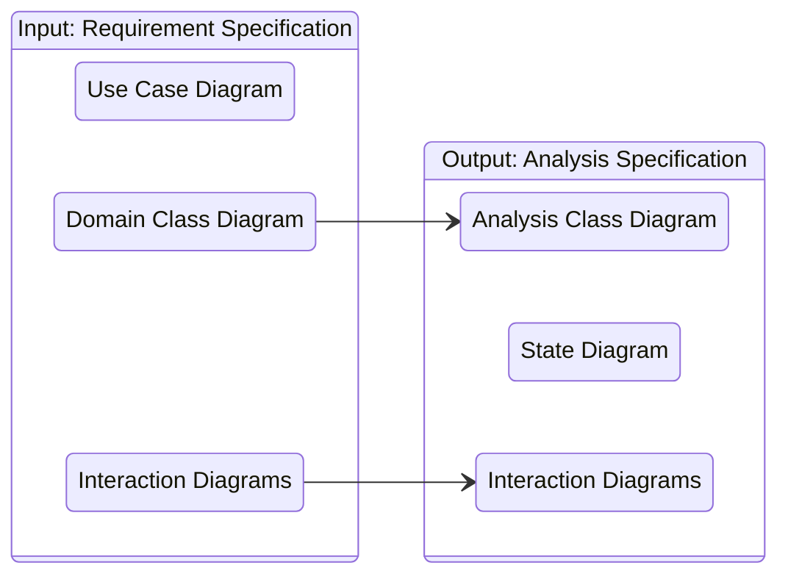

# **Analysis**
 

## **Table Of Contents**
 

- [**Analysis**](#analysis)
  - [**Table Of Contents**](#table-of-contents)
  - [**Overview**](#overview)

 
 
 
 

## **Overview**

The main goal of the analysis is to translate the domain class diagram to the more detailed analysis class diagram.  

The analysis class diagram is part of the analysis specification which will be used as the basis of the implementation.

 

