# **Analysis**
 

## **Table Of Contents**
 

- [**Analysis**](#analysis)
  - [**Table Of Contents**](#table-of-contents)
  - [**Overview**](#overview)
  - [**Analysis Class Diagram**](#analysis-class-diagram)
    - [**Basis**](#basis)
    - [**Goal**](#goal)
    - [**Analysis Classes**](#analysis-classes)
      - [**Entity Classes**](#entity-classes)
      - [**Control Classes**](#control-classes)
      - [**Boundary Class**](#boundary-class)
        - [**Actor-Usecase Boundary Class**](#actor-usecase-boundary-class)
        - [**Actor-All-Usecases Boundary Class**](#actor-all-usecases-boundary-class)
    - [**Tasks**](#tasks)
      - [**1. Unite domain class diagram with use case diagram**](#1-unite-domain-class-diagram-with-use-case-diagram)
      - [**2. Add methods to the analysis class diagram**](#2-add-methods-to-the-analysis-class-diagram)
      - [**3. Rework and clean analysis classes with heuristics**](#3-rework-and-clean-analysis-classes-with-heuristics)
        - [**1-1 relationship between two classes**](#1-1-relationship-between-two-classes)
        - [**Generalization**](#generalization)
      - [**4. Divide analysis classes into packages**](#4-divide-analysis-classes-into-packages)
  - [**Interaction Diagrams**](#interaction-diagrams)
    - [**Tasks**](#tasks-1)
      - [**1. Model Usecases As Mechanisms Of Analysis Classes**](#1-model-usecases-as-mechanisms-of-analysis-classes)
      - [**2. Create Communication Diagrams**](#2-create-communication-diagrams)
  - [**Verify The Analysis Specification**](#verify-the-analysis-specification)
    - [**Intra-Model Verification**](#intra-model-verification)
      - [**Use Case Diagram**](#use-case-diagram)
      - [**Class Diagram**](#class-diagram)
      - [**Interaction Diagram**](#interaction-diagram)
    - [**Inter-Model Verification**](#inter-model-verification)
      - [**Analysis Class Model vs. Use Case Model**](#analysis-class-model-vs-use-case-model)
      - [**Analysis Class Model vs. State Diagram**](#analysis-class-model-vs-state-diagram)
      - [**Interaction Diagram vs. State Diagram**](#interaction-diagram-vs-state-diagram)

 
 
 
 

## **Overview**

The analysis is based on the [requirement specification](./requirements_engineering.md#goal-requirement-specification). 

The main goal of the analysis is to translate the domain class diagram to the more detailed analysis class diagram.  

The analysis class diagram is part of the analysis specification which will act as the basis of the implementation.

 

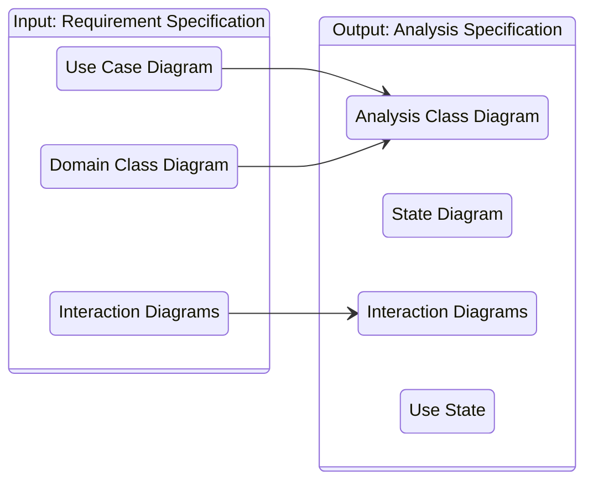

 
 
 
 

## **Analysis Class Diagram**
 
 
 

### **Basis**

The analysis class diagram is based on the
1. [domain class diagram](./requirements_engineering.md#create-a-domain-class-diagram)
2. [use case diagram](./requirements_engineering.md#create-a-use-case-diagram) (and its textual specification)

 
 
 

### **Goal**

The goal of the analysis class diagram is to
1. unite the [domain class diagram](./requirements_engineering.md#create-a-domain-class-diagram) and the [use case diagram](./requirements_engineering.md#create-a-use-case-diagram)
2. rework the [domain class diagram](./requirements_engineering.md#create-a-domain-class-diagram) and add details
3. verify that the diagram is complete and consistent

 
 
 

### **Analysis Classes**

Analysis classes still focus on the functional requirements and the domain, **not** on the implementation in a specific programming language.  

Signatures are only specified precisely for complex non-standard methods.

Compared to the domain classes they are more detailed and closer to the implementation.

 
 

#### **Entity Classes**

> An entity class describes a specific entity of the domain.  
Instances are typically long-lived and hold a large chunk of information.

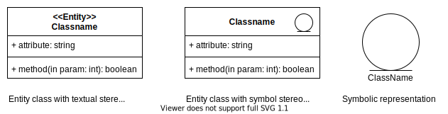

 
 

#### **Control Classes**

> A control class manages the interaction flow between the entity classes and boundary classes within a specific scenario.

 

 
 

#### **Boundary Class**

> A **boundary class** encapsulates the interactions between a specific actor and the system.  
> It is typically located on the periphery of the system or a subsystem.

 

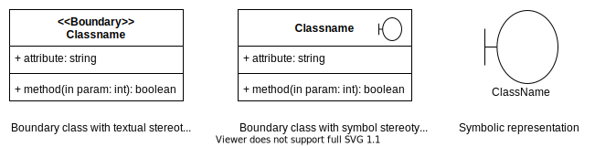

 
 

##### **Actor-Usecase Boundary Class**

An actor-usecase boundary class models the interaction between a specific actor and a specific use case.

> **Attention:**  Actor-Usecase boundary classes are suffixed with **AAS**!

 
 

##### **Actor-All-Usecases Boundary Class**

An actor-all-usecases boundary class models the interaction of a specific actor with **all** of his use cases. 

 

> **Attention:** Actor-All-Usecases boundary classes are suffixed with **AS**!

 
 
 

### **Tasks**
 
 

#### **1. Unite domain class diagram with use case diagram**

We create the first version of the analysis class diagram by uniting the [domain class diagram](./requirements_engineering.md#create-a-domain-class-diagram) and the [use case diagram](./requirements_engineering.md#create-a-use-case-diagram). We can also add additional classes.

 

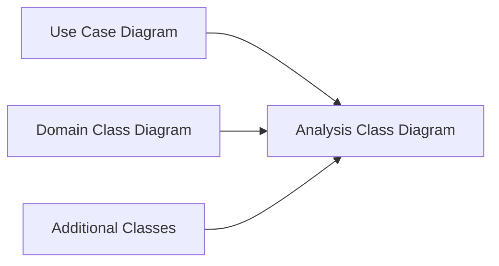

 
 

#### **2. Add methods to the analysis class diagram**

We add methods to the analysis class diagram.

 

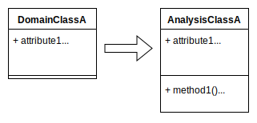

 

> **Attention:** Do not add standard operations like getters or setters to the analysis classes!

 
 

#### **3. Rework and clean analysis classes with heuristics**

 
 

##### **1-1 relationship between two classes**
 

> **Heuristic**  
> We model a 1-1 relationship between two classes if at least one relationship direction is optional (entity 0..1).

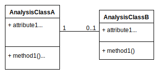

 

> **Heuristic**  
> We model a 1-1 relationship between two classes if one of those classes can have a relationship to another class that the other class does not have.

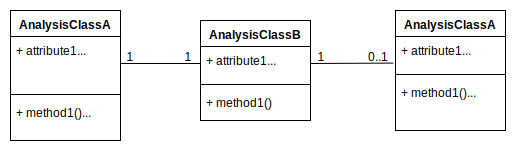

 

> **Heuristic**  
> In all other cases we replace the two classes with a single union class that contains all attributes and methods of both classes.

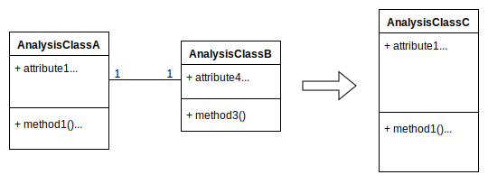

 
 

##### **Generalization**
 

> **Heuristic**  
> We use generalization if instances have different attributes and methods.

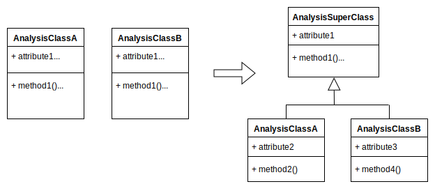

 

> **Heuristic**
> We use generalization if instances have the same attributes but different methods.

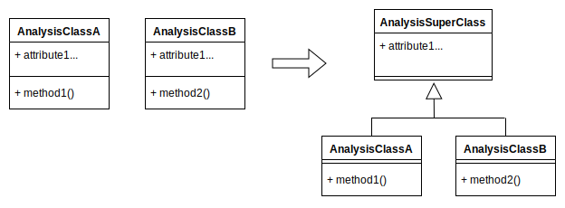

 

> **Heuristic**  
> We use generalization if instances have the same methods but different attributes.

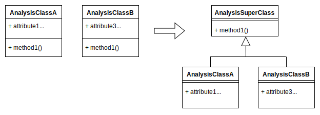

 

> **Heuristic**
> If instances with the same attributes and behavior can logically be split in disjunct classes we represent them by a single class and differentiate between them by adding an additional attribute that represents the difference.  
>
> This is especially useful when the attribute that represents the difference can change dynamically.

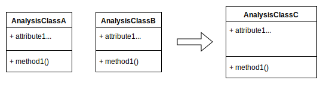

 
 

#### **4. Divide analysis classes into packages**

We divide the analysis classes into packages based on the involved actors and associated use cases.

 

> Analysis classes that are relevant for multiple actors or use cases are grouped into a separate **utility** package.

 

> **Attention:** In UML the package names are prefixed with the letter **P**!

 
 
 
 

## **Interaction Diagrams**

If the [requirement specification](./requirements_engineering.md#goal-requirement-specification) (result of the previous [requirements engineering](./requirements_engineering.md)) contains interaction diagrams, we use them as the basis for the analysis interaction diagram.  
In this step we refine the interaction diagrams.

 
 
 

### **Tasks**
 
 

#### **1. Model Usecases As Mechanisms Of Analysis Classes**

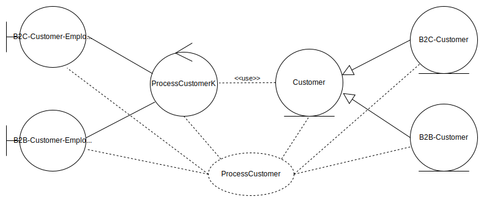

**Example:** Usecase "ProcessCustomer" modeled as a mechanism of analysis classes.

 
 

#### **2. Create Communication Diagrams**

We create a communication diagrams with the analysis classes for specific scenarios of each usecase that we modeled as a mechanism in the [previous step](#1-model-usecases-as-mechanisms-of-analysis-classes).

 

1. Add all entities that exist at the start of the scenario (most likely entity and boundary classes)
2. Add entities and relationships that are created, modified or destroyed during the scenarion (Entity and control classes)

 

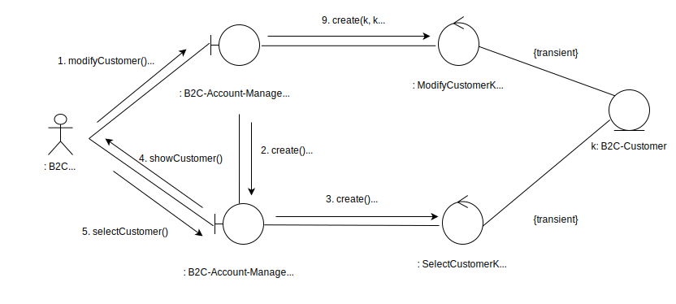

 
 
 
 

## **Verify The Analysis Specification**
 

During the verification we check whether the models are...

1. Complete
2. Clear / Unambiguous
3. Consistent

 
 
 

### **Intra-Model Verification**

In the intra-model verification we check each model independently.

 
 

#### **Use Case Diagram**

> Do the use cases and extension points of the `includes` and `extends` relationships exist?

 
 

#### **Class Diagram**

> Do all associations have a specified multiplicity?

 

> Are all derivable properties marked as derived?

 

> Do no subclasses implement redundant features?

 
 

#### **Interaction Diagram**

> Does every relationship have an operation name?

 

> Are all objects that are not part of the start state explicitly created?

 
 
 

### **Inter-Model Verification**

In the inter-model verification we check different models against each other.

 
 

#### **Analysis Class Model vs. Use Case Model**

> Are the scenarios of the use cases entirely based on the methods of the analysis classes?

 

> Is every method of the analysis classes used in at least one scenario of a use case?

 
 

#### **Analysis Class Model vs. State Diagram**

> Does every operation specified by a state transfer exist in the analysis class model?

 

> Does the precondition of a state transfer fulfill the precondition of the analysis class method associated with the transfer?

 

> Does the postcondition of the analysis class method match the state after the associated state transfer?

 
 

#### **Interaction Diagram vs. State Diagram**

> Is the message flow of the interaction diagram consistent with the state diagram?

 

> Does the action sequence of the state diagram match the sequence of received messages in the interaction diagram?

 

> Does the send action sequence of the state diagram match the sequence of sent messages in the interaction diagram?