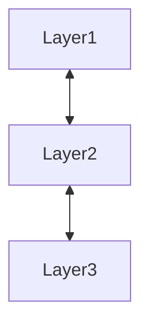

# **Architectural Design**
 

## **Table Of Contents**
 

- [**Architectural Design**](#architectural-design)
  - [**Table Of Contents**](#table-of-contents)
  - [**Overview**](#overview)
  - [**Goals Of The Architecture**](#goals-of-the-architecture)
  - [**Process**](#process)
  - [**Architectural Patterns**](#architectural-patterns)
    - [**Layer Architecture**](#layer-architecture)

 
 
 
 

## **Overview**

The architectural design is the start of the realization phase.  
During the design of the system architecture we split the system into subsystems and components.  
The result is specified in the architectural specification.

 
 
 
 

## **Goals Of The Architecture**

1. Reduce the complexity of each subsystem and component
2. Maximize the independence of the structure from the specific domain
3. Maximize the reusability of individual subsystems and components
4. Enable different developers to work on different components simultaneously
5. Use well known standards and concepts

 
 
 
 

## **Process**

The design of the archicture is an interative process.

 

 
 
 
 

## **Architectural Patterns**
 
 

### **Layer Architecture**

The layer architecture divides the system into different layers with separated responsibilities.  

Each layer can use the functionality of the layer directly beneath it via its public interface.  

Each layer offers services via its public interface to the layer directly above it.

 

