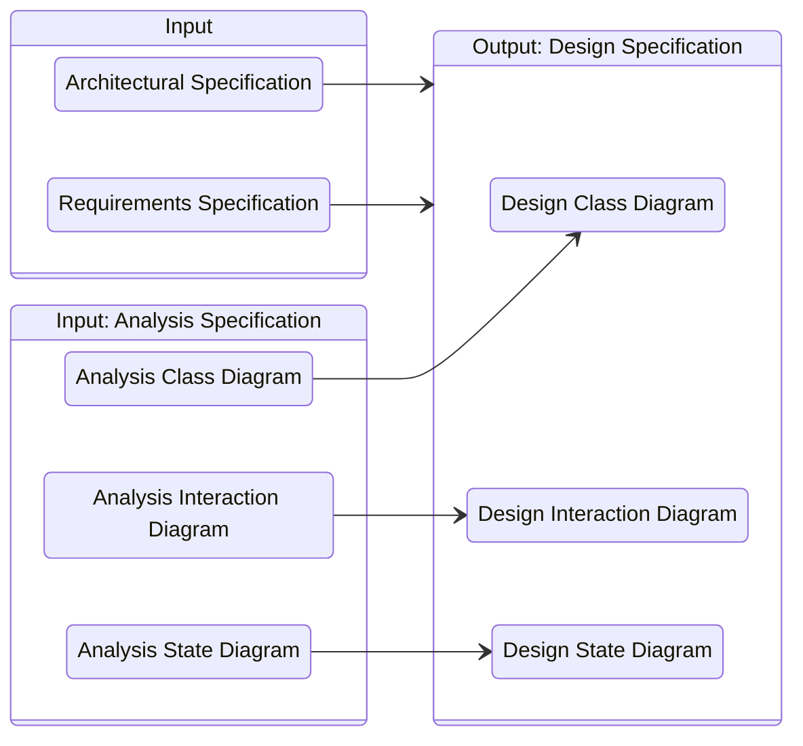

# **Design**
 

## **Table Of Contents**
 

- [**Design**](#design)
  - [**Table Of Contents**](#table-of-contents)
  - [**Overview**](#overview)
  - [**Design Specification**](#design-specification)
  - [**Design Process**](#design-process)
    - [**1. Basic Design**](#1-basic-design)
    - [**2. Detailed Design**](#2-detailed-design)
  - [**Design Concepts**](#design-concepts)
    - [**Information Hiding**](#information-hiding)
      - [**Advantages**](#advantages)
      - [**Heuristics**](#heuristics)
    - [**Coupling**](#coupling)
      - [**Heuristics**](#heuristics-1)

 
 
 
 

## **Overview**

In the design phase we refine the subsystems specified by the architecture according to the functional and nonfunctional requirements.

 

 
 
 
 

## **Design Specification**
 

The design specifies the **tasks**, **relationships** and **cooperations** of the modules and subsystems.  
It contains

1. Design Class Diagram
2. Design Interaction Diagram
3. Design State Diagram

 
 
 
 

## **Design Process**
 
 

### **1. Basic Design**

We map the analysis classes to the specified architecture.

 
 

### **2. Detailed Design**

We refine the basic design and add implementation details of the **actual implementation language**.

 
 
 
 

## **Design Concepts**
 
 
 

### **Information Hiding**

> Modules hide their implementation details from the outside.  
> External elements can only interact with the module via their external interface.

 
 

#### **Advantages**

1. External users are forced to use the element "the right way" over the API
2. External users can not modify the element implementation
3. Changes to the implementation of an element do not impact the external users of the element

 
 

#### **Heuristics**

> In the design we declare all properties as private.

 

> In generalization relationships we declare all attributes as private and add protected getter and setter methods to allow the subclasses to access the properties.

 
 
 

### **Coupling**

> Coupling describes the complexity of relations between the design elements.  
> Two classes are coupled when there is an association between them.

 

Examples

1. ClassA holds at least one reference to ClassB
2. ClassA is the superclass of ClassB
3. ClassA uses instances of ClassB in its implementation
4. ClassA has at least one operation that uses instances of ClassB as a parameter

 
 

#### **Heuristics**

> The goal of the design is to minimize the coupling between the elements (**weak coupling**).

 

> If only a few (below four) classes are coupled, we try to unite them into a single class.

 

> If a lot of classes (more than three) are coupled, we try to weaken the coupling by using a broker class.

 

> If the coupling is caused by a single functionality we try to weaken the coupling by moving the functionality to a different class.

 

> We can weaken the coupling within an aggregation by removing references of the part classes to the whole class.

 

> We can weaken the coupling within an aggregation by removing any usage relationship between the part classes.

 

> **Law Of Demeter**  
> An operation `o` of a class `A` should use only operations of the following classes:  
> 1. `A` itself
> 2. Classes that are parameters of `o`
> 3. Classes that are associated with `A`
> 4. Classes that are instantiated within `o`
