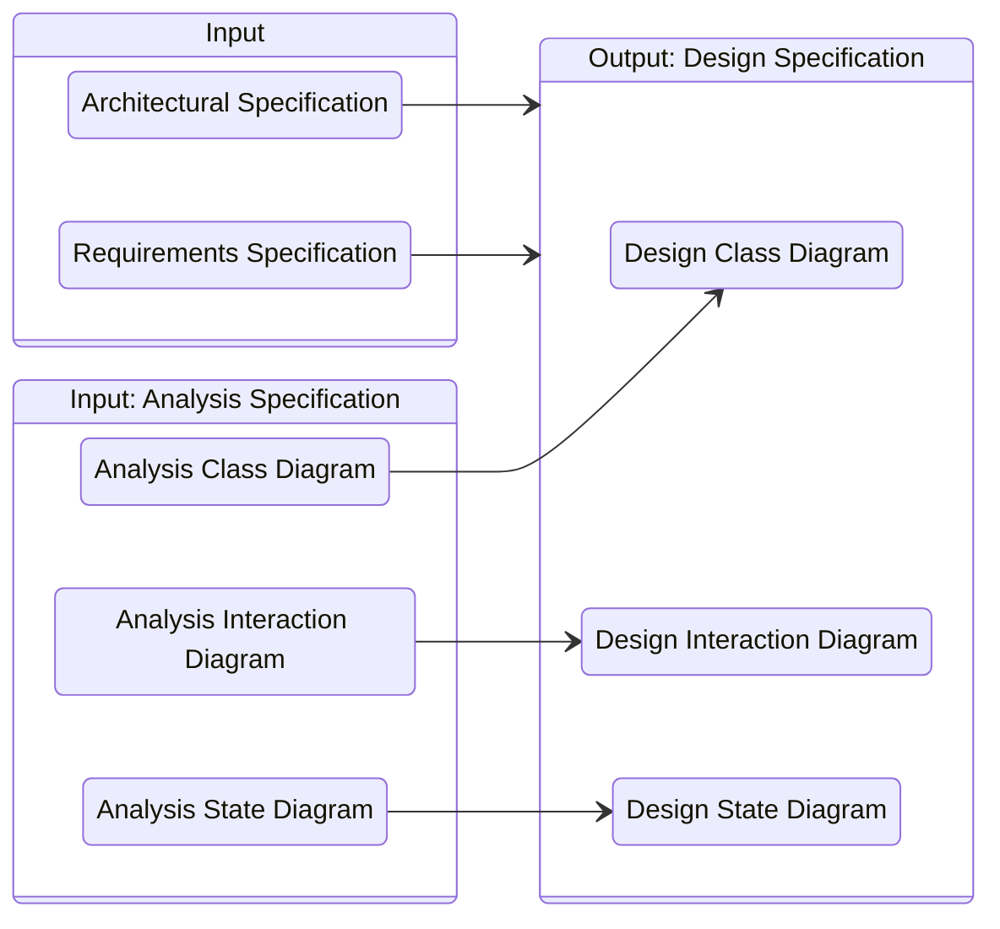
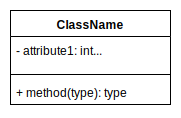
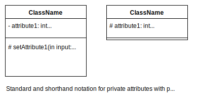

# **Design**
 

## **Table Of Contents**
 

- [**Design**](#design)
  - [**Table Of Contents**](#table-of-contents)
  - [**Overview**](#overview)
  - [**Design Specification**](#design-specification)
  - [**Design Process**](#design-process)
    - [**1. Basic Design**](#1-basic-design)
    - [**2. Detailed Design**](#2-detailed-design)
  - [**Design Concepts**](#design-concepts)
    - [**Information Hiding**](#information-hiding)
      - [**Advantages**](#advantages)
      - [**Heuristics**](#heuristics)
    - [**Coupling**](#coupling)
      - [**Heuristics**](#heuristics-1)
    - [**Cohesion**](#cohesion)
      - [**Heuristics**](#heuristics-2)
    - [**Compliance**](#compliance)
      - [**Generalization**](#generalization)
        - [**Heuristics**](#heuristics-3)
      - [**Inheritance**](#inheritance)
    - [**Design By Contract**](#design-by-contract)

 
 
 
 

## **Overview**

In the design phase we refine the subsystems specified by the architecture according to the functional and nonfunctional requirements.

 

 
 
 
 

## **Design Specification**
 

The design specifies the **tasks**, **relationships** and **cooperations** of the modules and subsystems.  
It contains

1. Design Class Diagram
2. Design Interaction Diagram
3. Design State Diagram

 
 
 
 

## **Design Process**
 
 

### **1. Basic Design**

We map the analysis classes to the specified architecture.

 
 

### **2. Detailed Design**

We refine the basic design and add implementation details of the **actual implementation language**.

 
 
 
 

## **Design Concepts**
 
 
 

### **Information Hiding**

> Modules hide their implementation details from the outside.  
> External elements can only interact with the module via their external interface.

 
 

#### **Advantages**

1. External users are forced to use the element "the right way" over the API
2. External users can not modify the element implementation
3. Changes to the implementation of an element do not impact the external users of the element

 
 

#### **Heuristics**

> In the design we declare all properties as private.

 

> In generalization relationships we declare all attributes as private and add protected getter and setter methods to allow the subclasses to access the properties.

 
 
 

### **Coupling**

> Coupling describes the complexity of relations between the design elements.  
> Two classes are coupled when there is an association between them.

 

Examples

1. ClassA holds at least one reference to ClassB
2. ClassA is the superclass of ClassB
3. ClassA uses instances of ClassB in its implementation
4. ClassA has at least one operation that uses instances of ClassB as a parameter

 
 

#### **Heuristics**

> The goal of the design is to minimize the coupling between the elements (**weak coupling**).

 

> If only a few (below four) classes are coupled, we try to unite them into a single class.

 

> If a lot of classes (more than three) are coupled, we try to weaken the coupling by using a broker class.

 

> If the coupling is caused by a single functionality we try to weaken the coupling by moving the functionality to a different class.

 

> We can weaken the coupling within an aggregation by removing references of the part classes to the whole class.

 

> We can weaken the coupling within an aggregation by removing any usage relationship between the part classes.

 

> **Law Of Demeter**  
> An operation `o` of a class `A` should use only operations of the following classes:  
> 1. `A` itself
> 2. Classes that are parameters of `o`
> 3. Classes that are associated with `A`
> 4. Classes that are instantiated within `o`

 
 
 

### **Cohesion**

> Cohesion describes the **logical** connection of the tasks a class realizes.

 
 

#### **Heuristics**

> The goal of the design is to maximize the cohesion of the elements (**strong cohesion**).  
> This is typically archieved by splitting the classes into smaller classes, but this can also strengthen the coupling. 

 

> We should split a class into subclasses if we can split the properties and methods into disjunct subsets so that all methods in a subset work exclusively on the properties in the subset.

 

> If a method implements multiple tasks of a functionality we should split the method into smaller pieces that each implement only a single task.

 
 
 

### **Compliance**

> Let `A` be the superclass of a subclass `B`.  
> Let `A.o` be an operation of class `A` that is overwritten by operation `B.o` of class `B`.  
>
> We call the operation `B.o` as compliant to `A.o` if  
> 1. signature(`A.o`) = signature(`B.o`)
> 2. precondition(`A.o`) => precondition(`B.o`)
> 3. postcondition(`B.o`) => postcondition(`A.o`)
>
> We call class `B` as compliant to class `A` if all its operation are compliant to their counterpart in `A`.

 
 

#### **Generalization**

> If a subclass `B` is compliant to a superclass `A` we call the relationship between these classes a generalization.

 

> The advantage of a generalization is a reduced test effort.

 
 

##### **Heuristics**

> If a superclass has properties that are not relevant for the subclass, then we should create a new superclass that contains all shared properties between these classes and create a generalization relationship between them.

 

> **Open-Closed-Principle**  
> We define classes so that they are open for subclass extension, but closed for modification.
> Operations of the superclasses that should be used by the subclasses are marked as protected.

 
 

#### **Inheritance**

> If a subclass `B` is **not** compliant to a superclass `A` we call the relationship between these classes an inheritance.

 
 
 

### **Design By Contract**
 

> An **interface** is a set of public operations of a class that represents a contract between a service user and provider about how to communicate with each other.

 

The contract contains the interface with specified pre- and postconditions as well as invariants.  

If the service user fulfills the precondition, it can expect the service provider to fulfill the postcondition.

Both user and provider have to fulfill the invariants of the contract before and after each operation.

Due to this contract we can easily locate errors: 
- if the precondition is not fulfilled, the user made a mistake
- if the postcondition is not fulfilled, the provider made a mistake

 

|                  |**Service User**        |**Service Provider**    |
|:-----------------|:-----------------------|:-----------------------|
|**Precondition**  |must fulfill            |expects to be fulfilled |
|**Postcondition** |expects to be fulfilled |must fulfill            |
|**Invariant**     |must fulfill            |must fulfill            |