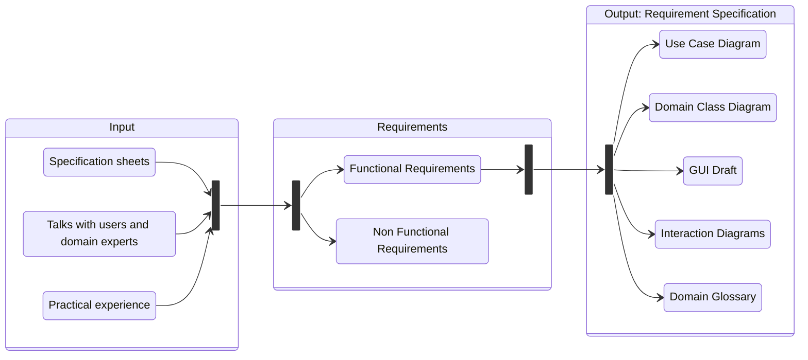
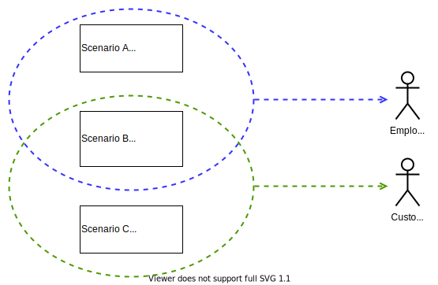

# **Requirements Engineering**
 

## **Table Of Contents**
 

- [**Requirements Engineering**](#requirements-engineering)
  - [**Table Of Contents**](#table-of-contents)
  - [**Overview**](#overview)
  - [**Domain Focus**](#domain-focus)
  - [**Tasks**](#tasks)
    - [**1. Extract the requirements**](#1-extract-the-requirements)
    - [**2. Negotiate the requirements**](#2-negotiate-the-requirements)
    - [**3. Specify the requirements**](#3-specify-the-requirements)
    - [**4. Validate the specification**](#4-validate-the-specification)
  - [**Goal: Requirement Specification**](#goal-requirement-specification)
  - [**Create A Use Case Diagram**](#create-a-use-case-diagram)
    - [**1. Collect And Describe Scenarios**](#1-collect-and-describe-scenarios)
    - [**2. Model Actors**](#2-model-actors)
    - [**3. Model Use Cases And Connect Them With Actors**](#3-model-use-cases-and-connect-them-with-actors)
    - [**4. Model Dependencies Between Use Cases**](#4-model-dependencies-between-use-cases)

 
 
 
 

## **Overview**

 
 
 
 

## **Domain Focus**

Every activity during the requirement engineering process focuses **only** on the requirements within the domain and uses the domain language.  
There are no specifications for any part of the implementation.  

 
 
 
 

## **Tasks**
 

### **1. Extract the requirements**

By reading the customer specification and by talking to domain experts, users and other stakeholders we:

- get an overview and understanding of the domain
- collect interaction scenarios between the users and the system
- extract use cases from these interactions
- reconcile extracted use cases with users and domain experts

 
 

### **2. Negotiate the requirements**

We negotiate the prioritization and scope of the extracted requirements with the stakeholders.

 
 

### **3. Specify the requirements**

We specify the extracted and negotiated requirements in the required documents. These documents will later act as the basis for the development and the acceptance tests.

 

### **4. Validate the specification**

We make sure that the requirement specification is complete and correct.

 
 
 
 

## **Goal: Requirement Specification**
 

The requirement specification bundles all requirements and should answer the following questions:

1. What problem should the system solve?
2. What functions should the system offer?

 

The requirement specification should contain the following documents:

|Document                                       |Mandatory          |
|:----------------------------------------------|:-----------------:|
|[Use Case Diagram](#create-a-use-case-diagram) |:heavy_check_mark: |
|Domain Class Model                             |:heavy_check_mark: |
|GUI Draft                                      |:x:                |
|Interaction Diagrams                           |:x:                |
|Domain Glossary                                |:x:                |

 
 
 
 

## **Create A Use Case Diagram**
 
 

### **1. Collect And Describe Scenarios**

We start by collecting and describing interaction scenarios between concrete users and the system.  

The description of a scenario has to contain the following information:  

1. scenario name
2. short summary
3. involved persons
4. action flow 

 

**Example:**

**Scenario** Order - All products in stock  
&nbsp;&nbsp;&nbsp;&nbsp;&nbsp;The employee takes the order via telephone.  
&nbsp;&nbsp;&nbsp;&nbsp;&nbsp;He checks the address, banking information and credit rating of the customer.  
&nbsp;&nbsp;&nbsp;&nbsp;&nbsp;Then he inserts the order details (ordered products and quantity) into the system.
**end** Order - All products in stock

 
 
 

### **2. Model Actors**

We group all users from the scenarios and model them with actors.  
Other systems that our system may interact with are also modeled with an actor.

 

> **Attention:** Every modeled actor requires at least one corresponding entity in the real world.

 

 
 
 

### **3. Model Use Cases And Connect Them With Actors**

We extract general use cases from the scenarios and collect them in a [use case diagram](../Modeling/UML/behavioralDiagrams/uml_use_case_diagram.md) and/or in a [textual specification](../Modeling/UML/behavioralDiagrams/uml_use_case_diagram.md#textual-specification) with pre- and postconditions.  

 

> Every modeled use case has to describe a well defined task that the system executes for a specified actor.

 

> **Attention:** Describe the use cases with domain terms, **not** with technical terms.

 

> **Attention:** A use case describes the usage of a system, **not** its implementation! 

 

> **Attention:** Be critical of use cases without any related actor!

 

> **Attention:** A complex use case can be split into multiple sub use cases!

 

 
 
 

### **4. Model Dependencies Between Use Cases**

We search for dependencies like [include](../Modeling/UML/behavioralDiagrams/uml_use_case_diagram.md#include), [extend](../Modeling/UML/behavioralDiagrams/uml_use_case_diagram.md#extend) or [generalization](../Modeling/UML/behavioralDiagrams/uml_use_case_diagram.md#generalization-1) between the use cases and add them to our model. We can also group use cases into packages.

 

> **Attention:** Relationships between use cases should be modeled late in the process and should not be overused!

 

> **Attention:** Relationships represent a static split of functionality, **not** some kind of flow!

 

> **Attention:** Relationships between packages should be kept to a minimum!

 

