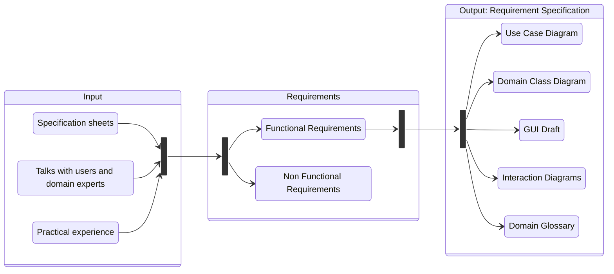

# **Requirements Engineering**
 

## **Table Of Contents**
 

- [**Requirements Engineering**](#requirements-engineering)
  - [**Table Of Contents**](#table-of-contents)
  - [**Overview**](#overview)
  - [**Domain Focus**](#domain-focus)
  - [**Tasks**](#tasks)
    - [**1. Get an overview of the domain**](#1-get-an-overview-of-the-domain)
    - [**2. Understand the domain**](#2-understand-the-domain)
    - [**3. Extract the requirements**](#3-extract-the-requirements)
    - [**4. Negotiate the prioritization and scope of the extracted requirements**](#4-negotiate-the-prioritization-and-scope-of-the-extracted-requirements)
    - [**5. Specify the extracted requirements to act as a basis for the development and acceptance test**](#5-specify-the-extracted-requirements-to-act-as-a-basis-for-the-development-and-acceptance-test)
    - [**6. Validate the generated specification to be complete and correct**](#6-validate-the-generated-specification-to-be-complete-and-correct)
  - [**Goal: Requirement Specification**](#goal-requirement-specification)

 
 
 
 

## **Overview**

 
 
 
 

## **Domain Focus**

Every activity during the requirement engineering process focuses **only** on the requirements within the domain and uses the domain language.  
There are no specifications for any part of the implementation.  

 
 
 
 

## **Tasks**
 

### **1. Get an overview of the domain**

 

### **2. Understand the domain**

 

### **3. Extract the requirements**

 

### **4. Negotiate the prioritization and scope of the extracted requirements**

 

### **5. Specify the extracted requirements to act as a basis for the development and acceptance test**

 

### **6. Validate the generated specification to be complete and correct**

 
 
 
 

## **Goal: Requirement Specification**
 

