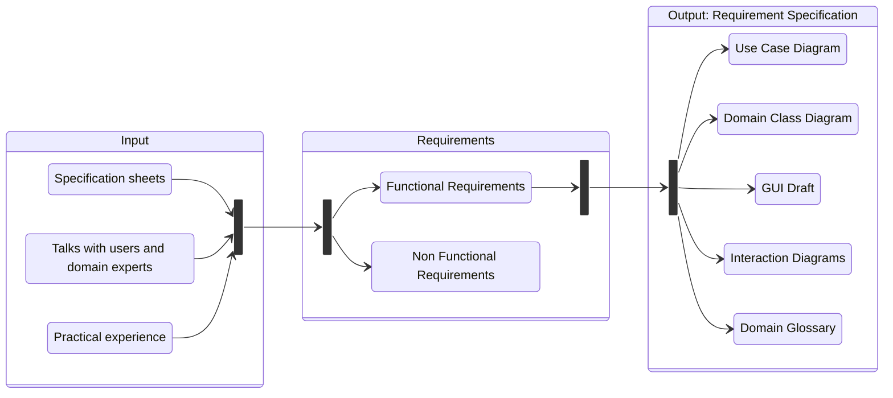

# **Requirements Engineering**
 

## **Table Of Contents**
 

- [**Requirements Engineering**](#requirements-engineering)
  - [**Table Of Contents**](#table-of-contents)
  - [**Overview**](#overview)
  - [**Domain Focus**](#domain-focus)
  - [**Tasks**](#tasks)
    - [**1. Extract the requirements**](#1-extract-the-requirements)
    - [**2. Negotiate the requirements**](#2-negotiate-the-requirements)
    - [**3. Specify the requirements**](#3-specify-the-requirements)
    - [**4. Validate the specification**](#4-validate-the-specification)
  - [**Goal: Requirement Specification**](#goal-requirement-specification)

 
 
 
 

## **Overview**

 
 
 
 

## **Domain Focus**

Every activity during the requirement engineering process focuses **only** on the requirements within the domain and uses the domain language.  
There are no specifications for any part of the implementation.  

 
 
 
 

## **Tasks**
 

### **1. Extract the requirements**

By reading the customer specification and by talking to domain experts, users and other stakeholders we:

- get an overview and understanding of the domain
- collect interaction scenarios between the users and the system
- extract use cases from these interactions
- reconcile extracted use cases with users and domain experts

 
 

### **2. Negotiate the requirements**

We negotiate the prioritization and scope of the extracted requirements with the stakeholders.

 
 

### **3. Specify the requirements**

We specify the extracted and negotiated requirements in the required documents. These documents will later act as the basis for the development and the acceptance tests.

 

### **4. Validate the specification**

We make sure that the requirement specification is complete and correct.

 
 
 
 

## **Goal: Requirement Specification**
 

The requirement specification bundles all requirements and should answer the following questions:

1. What problem should the system solve?
2. What functions should the system offer?

 

The requirement specification should contain the following documents:

|Document             |Mandatory          |
|:--------------------|:-----------------:|
|Use Case Diagram     |:heavy_check_mark: |
|Domain Class Model   |:heavy_check_mark: |
|GUI Draft            |:x:                |
|Interaction Diagrams |:x:                |
|Domain Glossary      |:x:                |
