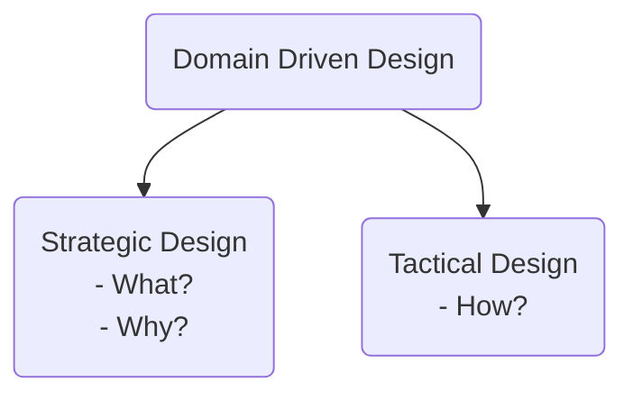

# **Domain Driven Design Overview**
 
 

## **Table Of Contents**
 

- [**Domain Driven Design Overview**](#domain-driven-design-overview)
  - [**Table Of Contents**](#table-of-contents)
  - [**Overview**](#overview)

 
 
 
 

## **Overview**

