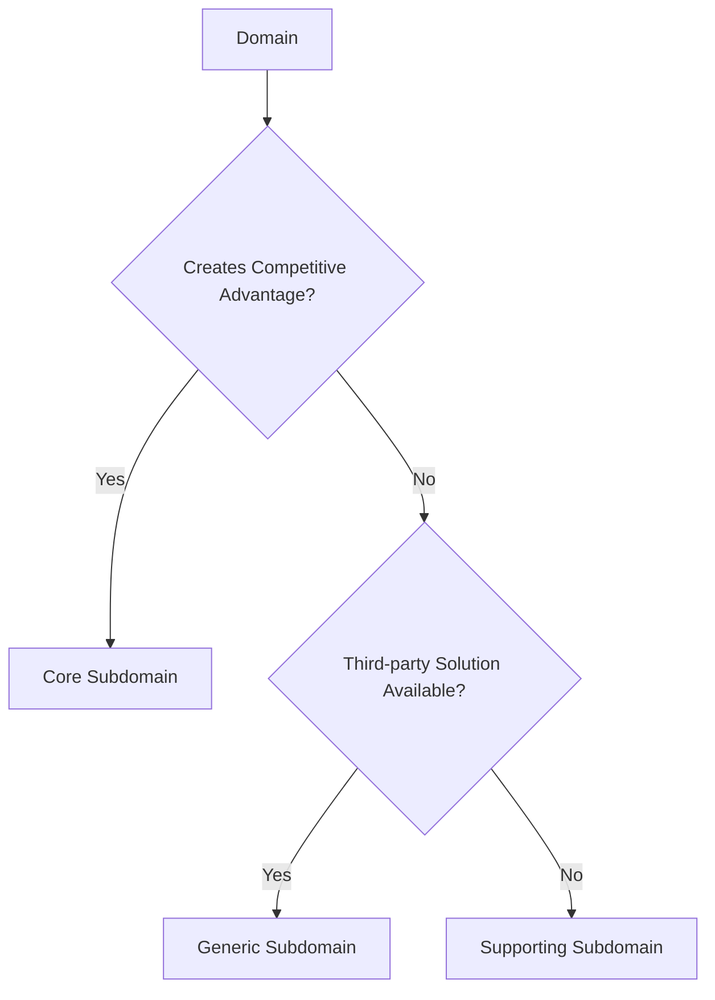
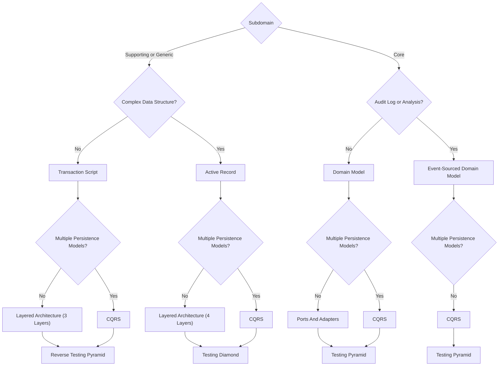

# **Domain Driven Design Strategic Design**
 

## **Table Of Contents**

- [**Domain Driven Design Strategic Design**](#domain-driven-design-strategic-design)
  - [**Table Of Contents**](#table-of-contents)
  - [**Process**](#process)
    - [**1. Collect Information**](#1-collect-information)
    - [**2. Identify The Domains**](#2-identify-the-domains)
    - [**3. Work Out An Ubiquitous Language**](#3-work-out-an-ubiquitous-language)
    - [**4. Examine The High Level Components Of Existing Solution**](#4-examine-the-high-level-components-of-existing-solution)
    - [**5. Create A Context Map For The Components**](#5-create-a-context-map-for-the-components)
    - [**6. Identify Weaknesses**](#6-identify-weaknesses)
    - [**7. Improve In Small Iterative Steps**](#7-improve-in-small-iterative-steps)
  - [**Decision Tree**](#decision-tree)

 
 
 
 

## **Process**
 
 

### **1. Collect Information**

- Which products or services is the business offering?
- Who are the customers?
- How is the business creating the products or services?
- Who are the competitors of the business?
- What are the advantages and disadvantages of the product or service?

 
 

### **2. Identify The Domains**

 
 

### **3. Work Out An Ubiquitous Language**

 
 

### **4. Examine The High Level Components Of Existing Solution**

- Which components have independent lifecycles?
- Which identified subdomains does each component contain?
- What patterns were used to implement the logic?
- What architecture was used?

 
 

### **5. Create A Context Map For The Components**

 
 

### **6. Identify Weaknesses**

- Is domain functionality implemented multiple times?
- Are multiple teams working on the same components?
- Is the integration of the components messy?
- Is core domain functionality implemented by a third party?

 
 

### **7. Improve In Small Iterative Steps**

- Enforce the boundaries of the subdomains with logical boundary mechanisms (packages, modules, namespaces, ...)
- Transform the logical boundaries of the most important subdomains to the physical boundaries of a bounded context
- Model the relationship between the extracted bounded contexts according to the integration patterns

 
 
 
 

## **Decision Tree**

