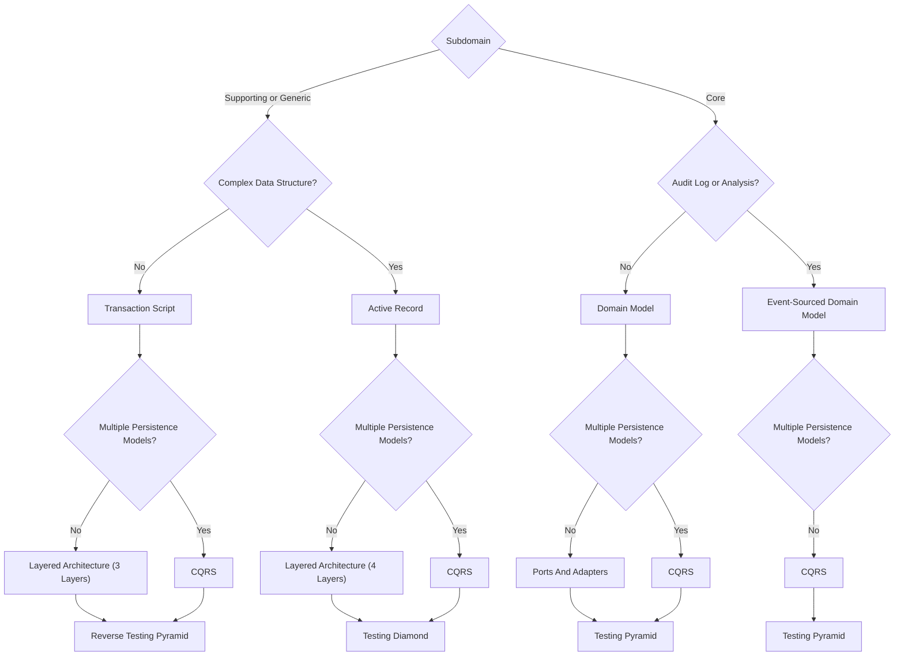

# **Domain Driven Design Strategic Design**
 

## **Table Of Contents**

- [**Domain Driven Design Strategic Design**](#domain-driven-design-strategic-design)
  - [**Table Of Contents**](#table-of-contents)
  - [**Overview**](#overview)
  - [**Mental Model**](#mental-model)
  - [**Decision Tree**](#decision-tree)

 
 
 
 

## **Overview**

Analysis:

- Identify the core, generic and supporting subdomains

 
 
 
 

## **Mental Model**

- business entities and their behavior
- Relationships between them (Cause and effect)
- invariants

 
 
 
 

## **Decision Tree**

