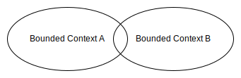

# **Domain Driven Design Strategic Design**
 

## **Table Of Contents**

- [**Domain Driven Design Strategic Design**](#domain-driven-design-strategic-design)
  - [**Table Of Contents**](#table-of-contents)
  - [**Overview**](#overview)
  - [**Domain**](#domain)
  - [**Subdomains**](#subdomains)
    - [**Core Subdomain**](#core-subdomain)
    - [**Generic Subdomain**](#generic-subdomain)
    - [**Supporting Subdomain**](#supporting-subdomain)
  - [**Ubiquitous Language**](#ubiquitous-language)
    - [**Usage**](#usage)
    - [**Evolution**](#evolution)
    - [**Heuristics**](#heuristics)
    - [**Consistency**](#consistency)
    - [**Tools**](#tools)
  - [**Modelling**](#modelling)
  - [**Mental Model**](#mental-model)
  - [**Bounded Context**](#bounded-context)
    - [**Link to subdomains**](#link-to-subdomains)
    - [**Communication Patterns**](#communication-patterns)
      - [**Cooperation**](#cooperation)
        - [**Partnership**](#partnership)
        - [**Shared Kernel**](#shared-kernel)
      - [**Customer Supplier**](#customer-supplier)
        - [**Conformist**](#conformist)
        - [**Anticorruption Layer**](#anticorruption-layer)
        - [**Open-Host Service**](#open-host-service)
      - [**Separate Ways**](#separate-ways)
    - [**Context Map**](#context-map)
    - [**Heuristics**](#heuristics-1)
      - [**Implementation**](#implementation)
      - [**Size**](#size)
      - [**Cohesion**](#cohesion)

 
 
 
 

## **Overview**

Analysis:

- Identify the core, generic and supporting subdomains

 
 
 
 

## **Domain**

> A **domain** is a main activity of a company.  
> A company can be active in multiple domains.

 
 
 
 

## **Subdomains**

> A **subdomain** is a part of a domain.  
> It communicates with other subdomains to fulfill the goal of the domain.

 

From a technical perspective a subdomain represents a group of cohesive [use cases](../Modeling/UML/behaviorDiagrams/uml_use_case_diagram.md) that work on the same data.

 

|**Subdomain**                           |**Competitive Advantage** |**Complexity** |**Volatility** |**Implementation**   |
|:---------------------------------------|:------------------------:|:-------------:|:-------------:|:-------------------:|
|[**Core**](#core-subdomain)             |Yes                       |High           |High           |Inhouse              |
|[**Generic**](#generic-subdomain)       |No                        |High           |Low            |Third party          |
|[**Supporting**](#supporting-subdomain) |No                        |Low            |Low            |Inhouse or outsource |

 
 
 

### **Core Subdomain**

> A **core subdomain** contains complex activities that generate a competitive advantage for the company.  
> The more complex the core subdomain is the more long-term this advantage is.

 
 
 

### **Generic Subdomain**

> A **generic subdomain** contains complex activities that all companies do in the same or similar manner and therefore do not generate a competitive advantage.  

 
 
 

### **Supporting Subdomain**

> A **supporting subdomain** contains activities that support the activities of the core subdomain but do not generate a competitive advantage.  
> Typical activities are [CRUD](../../glossary.md#crud-operation) and [ETL](../../glossary.md#etl-operation) Operations.

 
 
 
 

## **Ubiquitous Language**

> The **ubiquitous language** is the precise and consistent language of the domain experts.  
> It is used to describe the domain models that the implementation is based upon.

 
 
 

### **Usage**

The ubiquitous language should be used
- by the domain experts
- by the developers
- by all stakeholders 
- in all steps of the development process
- instead of a technical translation of the domain knowledge
- within its [bounded context](#bounded-context)

 
 
 

### **Evolution**

The ubiquitous language should be constantly checked and evolved during the project.

 
 
 

### **Heuristics**
 
 

### **Consistency**

> Eliminate all assumptions from the ubiquitous language.

 

> Eliminate all **synonyms** (different words with the same meaning) from the ubiquitous language.

 

> Eliminate all **homonyms** (same words that have different meanings) from the ubiquitous langague by splitting the language into two or more [bounded contexts](#bounded-context).

 
 

### **Tools**

> Use a glossary to define the domain entities (typically described with nouns).

 

> Define the interaction between entities with use cases.

 
 
 
 

## **Modelling**

> A **model** is a simplified representation of an entity of the real world that is used to reach a specific goal.  
> It only includes aspects of the entity that are relevant for the specified goal and its use is limited to this goal.

 
 
 
 

## **Mental Model**

- business entities and their behavior
- Relationships between them (Cause and effect)
- invariants

 
 
 
 

## **Bounded Context**

> A **bounded context** defines an area in which an ubiquitous language and the models described with it can be applied consistently.

 
 
 

### **Link to subdomains**

- subdomains are *identified*
- bounded contexts are *designed*

 

 
 
 

### **Communication Patterns**

Bounded contexts communicate with each other via *contracts*, because their  language and models can differ.

 
 

#### **Cooperation**
 
 

##### **Partnership**

> The teams of two bounded context coordinate the communication between the contexts with each other, resolve conflicts and no team dominates the other.

 

 
 

##### **Shared Kernel**

> A **shared kernel** contains models of a subdomain that are implemented in multiple bounded contexts.

 

 

Since each change of a model immediately affects all bounded contexts the shared kernel should
- be limited in scope
- only expose elements that have to be implemented by the bounded contexts
- only contain contracts and data structures used for transportation

 

The usage of a shared kernel is a tradeoff between the *cost of code duplication* and the *cost of the coordination overhead* which is heavily influenced by the volatility of the models.

 
 

#### **Customer Supplier**
 
 

##### **Conformist**

> The supplier (*upstream*) dictates the communication contract and the customer (*downstream*) adapts its implementation to that.

 

 
 

##### **Anticorruption Layer**

> The supplier (*upstream*) dictates the communication contract but the customer (*downstream*)  translates the answer of the supplier to its language and models.

 

 
 

##### **Open-Host Service**

> The supplier (*upstream*) offers a public interface (*Published Language*) that is independent of its implementation model to his customers (*downstream*) in order to protect them from changes.

 

 
 

#### **Separate Ways**

> The teams duplicate functionalities in their bounded contexts in order to avoid communication and cooperation.

 
 
 

### **Context Map**

> A **context maps** shows all communication between the bounded context and the selected patterns.

 
 
 

### **Heuristics**
 
 

#### **Implementation**

> Each bounded context should be implemented as a separate service or project by a single team. A bounded context therefore also represents the physical border of the system they are implemented upon.

 
 

#### **Size**

> Smaller bounded contexts can scale independently of one another and they can be handled by separate development teams. The downside is the integration overhead.

 

> Bigger bounded contexts reduce the integration overhead but make it harder to be consistent.

 
 

#### **Cohesion**

> Make sure to keep cohesive functionality within the same context!
