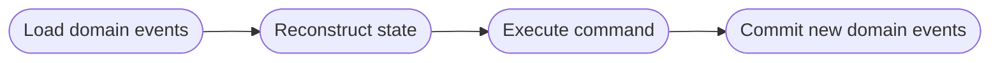

# **DDD - Domain Model**
<br>

## **Table Of Contents**

- [**DDD - Domain Model**](#ddd---domain-model)
  - [**Table Of Contents**](#table-of-contents)
  - [**Definition**](#definition)
  - [**When To Use**](#when-to-use)
  - [**Components**](#components)
    - [**Value Object**](#value-object)
      - [**Definition**](#definition-1)
      - [**Heuristics**](#heuristics)
    - [**Entity**](#entity)
    - [**Aggregate**](#aggregate)
      - [**Transactional Boundary**](#transactional-boundary)
      - [**Scope**](#scope)
      - [**Aggregate Root**](#aggregate-root)
      - [**Commands**](#commands)
      - [**Communication Between Aggregates**](#communication-between-aggregates)
        - [**Outbox Pattern**](#outbox-pattern)
        - [**Saga Pattern**](#saga-pattern)
        - [**Process Manager Pattern**](#process-manager-pattern)
    - [**Domain Events**](#domain-events)
    - [**Domain Service**](#domain-service)
  - [**Optional Extension: Event-Sourced Domain Model**](#optional-extension-event-sourced-domain-model)
    - [**Event Sourcing Pattern**](#event-sourcing-pattern)
    - [**Event-Sourced Domain Model**](#event-sourced-domain-model)
      - [**Advantages And Disadvantages**](#advantages-and-disadvantages)

<br>
<br>
<br>
<br>

## **Definition**

> A **domain model** contains the data and the behavior of the domain objects.  
> The data is modeled as *Plain Old Objects*.

- used for complex business logic (complex state transitions, business rules and invariants)

<br>
<br>
<br>
<br>

## **When To Use**

We use the domain model for complex business logic.

<br>
<br>
<br>
<br>

## **Components**
<br>


<br>
<br>
<br>

### **Value Object**
<br>
<br>
<br>

#### **Definition**

> A **value object** is an immutable object that can be identified by the combination of its values.

<br>

Example:

```typescript
class Color {
   private red: number;
   private green: number;
   private blue: number;

   // implementation
}
```

<br>
<br>

#### **Heuristics**

> Use value objects whenever possible.

<br>

> Use value objects for domain objects that are used as traits of other domain objects.

<br>
<br>
<br>

### **Entity**

> An **entity** is an object that can only be identified by a separate id property.

<br>

Example:

```typescript
class Person {
   public id: UserId;
   public name: Name;

   // implementation
}
```

<br>
<br>
<br>

### **Aggregate**

> An **aggregate** is an entity that references other entities and ensures the consistency of the data according to the business rules. 
>  
> It implements the business logic, invariants and input validation.


<br>
<br>
<br>

#### **Transactional Boundary**

> An aggregate represents a transactional boundary:  
> - all changes to the state have to be committed in a single database transaction
> - changes are limited to this aggregate

<br>
<br>
<br>

#### **Scope**

An aggregate contains only those entities and value objects that have to be strictly consistent at all times.

Data of other aggregates should only be referenced by their id.

<br>
<br>
<br>

#### **Aggregate Root**

> The **aggregate root** implements the entire public interface of the aggregate.

<br>
<br>
<br>

#### **Commands**

> **Commands** are all methods of the aggregate´s public interface that modify the aggregate data.

<br>

Commands can be implemented directly as a *public method* or a *parameter object*.

<br>

```typescript
addUser(id: UserId, name: Name) {
  // implementation
}

changeUserName(id: UserId, newName: Name) {
  // implementation
}
```

<br>

```typescript
execute(command: AddUser) {
  // implementation
}

execute(command: ChangeUserName) {
  // implementation
}
```

<br>
<br>
<br>

#### **Communication Between Aggregates**
<br>
<br>

##### **Outbox Pattern**


<br>

- The aggregate commits its state and the domain events in a single transaction
- The state and the domain events are typically stored in different tables:


<br>

- The message relay can query the database by *pulling* or *pushing*

<br>
<br>

##### **Saga Pattern**

> A **saga** is a business process that consists of multiple transactions.

<br>


<br>

The saga ...
- listens to the domain events of the aggregates
- reacts to the incoming domain events by sending commands 
- is used for simple processes without variations (*if-else-statements*)
- is implicitly instantiated when a specific event occurs

<br>
<br>

##### **Process Manager Pattern**


The process manager ...

- implements a process based on business logic
- decides the next process steps
- is explicitly instantiated

<br>
<br>
<br>

### **Domain Events**

> **Domain events** are part of the public interface of an aggregate and describe relevant event that occurred within it.  
> 
> Aggregates can emit domain events and listen to domain events of other aggregates.

<br>
<br>
<br>

### **Domain Service**

> A **domain service** is a stateless object that implements business logic that either belong to no aggregate or value object or affects multiple aggregates.  
> 
> They are especially useful for calculations that uses data from multiple sources. 

<br>
<br>
<br>
<br>

## **Optional Extension: Event-Sourced Domain Model**
<br>
<br>
<br>

### **Event Sourcing Pattern**

> The **event sourcing pattern** represents all changes in an aggregate´s lifetime as a domain event.  
>
> The events are chronologically stored in a read-only event store that acts as the *source of truth* of the system.
>
> The aggregate´s state at any point of time can be reconstructed by applying all relevant events from the event store.

<br>


<br>
<br>
<br>

### **Event-Sourced Domain Model**

An event-sourced domain model uses the event sourcing pattern to store the data of its aggregates.

<br>



<br>
<br>

#### **Advantages And Disadvantages**
<br>

|**Advantages**                         |**Disadvantages**                          |
|:--------------------------------------|:------------------------------------------|
|State development history              |Difficult to adjust the event table schema |
|Ability to reconstruct previous states |Makes architecture more complex            |