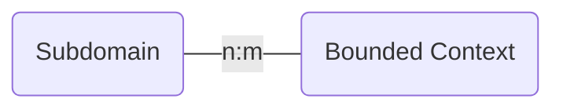
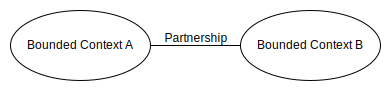
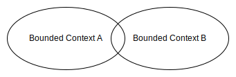
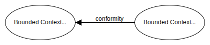
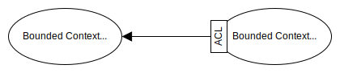

# **DDD - Bounded Context**
 

## **Table Of Contents**

- [**DDD - Bounded Context**](#ddd---bounded-context)
  - [**Table Of Contents**](#table-of-contents)
  - [**Bounded Context**](#bounded-context)
  - [**Link To Subdomains**](#link-to-subdomains)
  - [**Communication Patterns**](#communication-patterns)
    - [**Cooperation**](#cooperation)
      - [**Partnership**](#partnership)
      - [**Shared Kernel**](#shared-kernel)
    - [**Customer Supplier**](#customer-supplier)
      - [**Conformist**](#conformist)
      - [**Anticorruption Layer**](#anticorruption-layer)
      - [**Open-Host Service**](#open-host-service)
    - [**Separate Ways**](#separate-ways)
  - [**Context Map**](#context-map)
  - [**Heuristics**](#heuristics)
    - [**Implementation**](#implementation)
    - [**Size**](#size)
    - [**Cohesion**](#cohesion)

 
 
 
 

## **Bounded Context**

> A **bounded context** defines an area in which an [ubiquitous language](./ddd-ubiquitous-language.md) and the models described with it can be applied consistently.

 
 
 
 

## **Link To Subdomains**

- [subdomains](ddd-domains.md) are *identified*
- bounded contexts are *designed*

 

 
 
 
 

## **Communication Patterns**

Bounded contexts communicate with each other via *contracts*, because their language and models can differ.

 
 
 

### **Cooperation**
 
 

#### **Partnership**

> The teams of two bounded context coordinate the communication between the contexts with each other, resolve conflicts and no team dominates the other.

 

 
 

#### **Shared Kernel**

> A **shared kernel** contains models of a subdomain that are implemented in multiple bounded contexts.

 

 

Since each change of a model immediately affects all bounded contexts the shared kernel should
- be limited in scope
- only expose elements that have to be implemented by the bounded contexts
- only contain contracts and data structures used for transportation

 

The usage of a shared kernel is a tradeoff between the *cost of code duplication* and the *cost of the coordination overhead* which is heavily influenced by the volatility of the models.

 
 
 

### **Customer Supplier**
 
 

#### **Conformist**

> The supplier (*upstream*) dictates the communication contract and the customer (*downstream*) adapts its implementation to that.

 

 
 

#### **Anticorruption Layer**

> The supplier (*upstream*) dictates the communication contract but the customer (*downstream*)  translates the answer of the supplier to its language and models.

 

 
 

#### **Open-Host Service**

> The supplier (*upstream*) offers a public interface (*Published Language*) that is independent of its implementation model to his customers (*downstream*) in order to protect them from changes.

 

 
 

### **Separate Ways**

> The teams duplicate functionalities in their bounded contexts in order to avoid communication and cooperation.

 
 
 
 

## **Context Map**

> A **context maps** shows all communication between the bounded context and the selected patterns.

 

 
 
 
 

## **Heuristics**
 
 
 

### **Implementation**

> Each bounded context should be implemented as a separate service or project by a single team. A bounded context therefore also represents the physical border of the system they are implemented upon.

 
 
 

### **Size**

> Smaller bounded contexts can scale independently of one another and they can be handled by separate development teams. The downside is the integration overhead.

 

> Bigger bounded contexts reduce the integration overhead but make it harder to be consistent.

 
 
 

### **Cohesion**

> Make sure to keep cohesive functionality within the same context!

