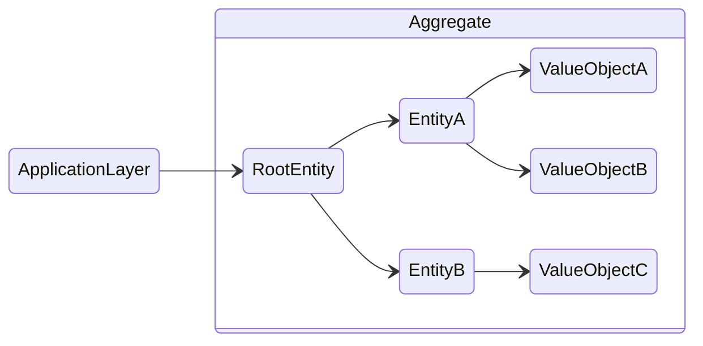

# **DDD - Domain Model**
<br>

## **Table Of Contents**

- [**DDD - Domain Model**](#ddd---domain-model)
  - [**Table Of Contents**](#table-of-contents)
  - [**Definition**](#definition)
  - [**Value Object**](#value-object)
    - [**Definition**](#definition-1)
    - [**Advantages**](#advantages)
    - [**Heuristics**](#heuristics)
  - [**Entity**](#entity)
  - [**Aggregate**](#aggregate)
    - [**Transactional Boundary**](#transactional-boundary)
    - [**Scope**](#scope)
    - [**Aggregate Root**](#aggregate-root)
    - [**Commands**](#commands)
  - [**Domain Events**](#domain-events)
  - [**Domain Service**](#domain-service)

<br>
<br>
<br>
<br>

## **Definition**

> A **domain model** contains the data and the behavior of the domain objects.  
> The data is modeled as *Plain Old Objects*.

- used for complex business logic (complex state transitions, business rules and invariants)

<br>
<br>
<br>
<br>

## **Value Object**
<br>
<br>
<br>

### **Definition**

> A **value object** is an immutable object that can be identified by the combination of its values.

<br>

Example:

```typescript
class Color {
   private red: number;
   private green: number;
   private blue: number;

   // implementation
}
```

<br>
<br>
<br>

### **Advantages**

- value objects encapsulate related business logic like validation
- value objects do not have any side effects
- code becomes more descriptive

<br>
<br>
<br>

### **Heuristics**

> Use value objects whenever it is possible.

<br>

> Use value objects for domain objects that are used as traits of other domain objects.

<br>
<br>
<br>
<br>

## **Entity**

> An **entity** is an object that can only be identified by a separate id property.

<br>

Example:

```typescript
class Person {
   public id: UserId;
   public name: Name;

   // implementation
}
```

<br>
<br>
<br>
<br>

## **Aggregate**

> An **aggregate** is an entity that references other entities and ensures the consistency of the data according to the business rules.  
> It implements the business logic, invariants and input validation.



<br>
<br>
<br>

### **Transactional Boundary**

> An aggregate represents a transactional boundary:  
> - all changes to the state have to be committed in a single transaction
> - changes are limited to this aggregate

<br>
<br>
<br>

### **Scope**

An aggregate contains only those entities and value objects that have to be strictly consistent at all times.

Data of other aggregates should be only referenced by their id.

<br>
<br>
<br>

### **Aggregate Root**

> The **aggregate root** is the only enitity that implements the entire public interface of the aggregate.

<br>
<br>
<br>

### **Commands**

> **Commands** are all methods of the aggregate´s public interface that modify the aggregate data.

<br>

Commands can be implemented directly as a *public method* or a *parameter object*.

<br>

```typescript
addUser(id: UserId, name: Name) {
  // implementation
}

changeUserName(id: UserId, newName: Name) {
  // implementation
}
```

<br>

```typescript
execute(command: AddUser) {
  // implementation
}

execute(command: ChangeUserName) {
  // implementation
}
```

<br>
<br>
<br>
<br>

## **Domain Events**

> **Domain events** are part of the public interface of an aggregate and describe relevant event that occurred within it.  
> Aggregates can emit domain events and listen to domain events of other aggregates.

<br>
<br>
<br>
<br>

## **Domain Service**

> A **domain service** is a stateless object that implements business logic that either belong to no aggregate or value object or affects multiple aggregates.  
> They are especially useful for calculations that uses data from multiple sources. 