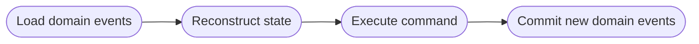

# **DDD - Event-Sourced Domain Model**
 

## **Table Of Contents**

- [**DDD - Event-Sourced Domain Model**](#ddd---event-sourced-domain-model)
  - [**Table Of Contents**](#table-of-contents)
  - [**Event Sourcing Pattern**](#event-sourcing-pattern)
  - [**Event-Sourced Domain Model**](#event-sourced-domain-model)

 
 
 
 

## **Event Sourcing Pattern**

> The **event sourcing pattern** represents and saves all changes that happens to an aggregate in its lifetime as a domain event.  
> The state of the aggregate can reconstructed by applying all saved events chronologically.

 

 

All events are stored in the read-only *event store* that acts as the *source of truth* for the system.

 
 
 
 

## **Event-Sourced Domain Model**

An event-sourced [domain model](./ddd-domain-model.md) uses the event sourcing pattern to store the data of its aggregates.

 

 

|**Advantages**                         |**Disadvantages**                          |
|:--------------------------------------|:------------------------------------------|
|State development history              |Difficult to adjust the event table schema |
|Ability to reconstruct previous states |Makes architecture more complex            |