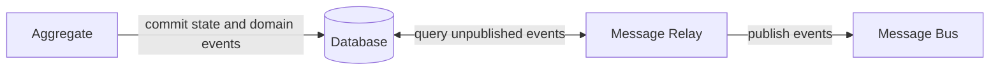
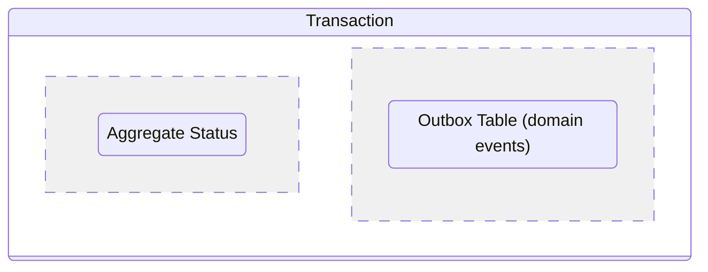
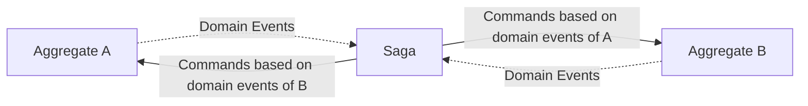
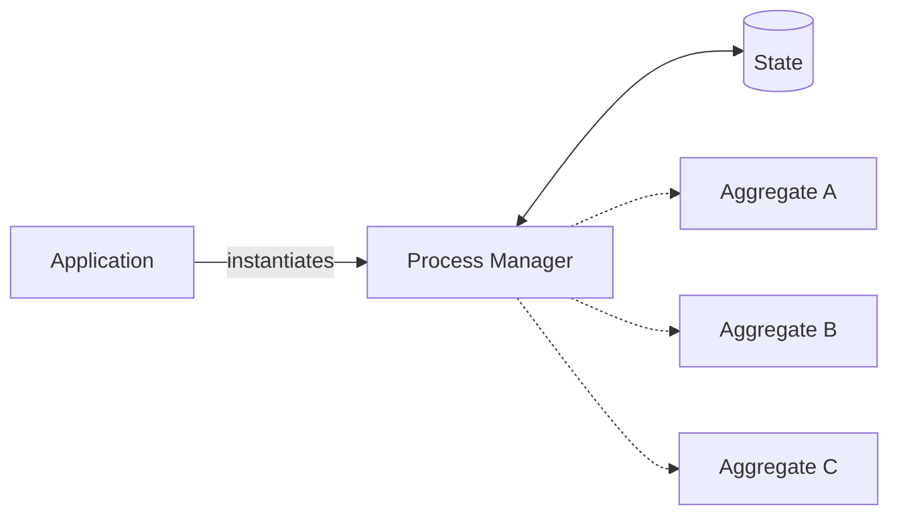

# **DDD - Aggregate Communication**
 

## **Table Of Contents**

- [**DDD - Aggregate Communication**](#ddd---aggregate-communication)
  - [**Table Of Contents**](#table-of-contents)
  - [**Publishing Domain Events**](#publishing-domain-events)
    - [**Outbox Pattern**](#outbox-pattern)
    - [**Saga Pattern**](#saga-pattern)
    - [**Process Manager Pattern**](#process-manager-pattern)

 
 
 
 

## **Publishing Domain Events**

Aggregates publish domain events to communicate with other components of the system.

 
 
 

### **Outbox Pattern**

 

- The aggregate commits its state and the domain events in a single transaction
- The state and the domain events are typically stored in different tables:

 

- The message relay can query the database by *pulling* or *pushing*

 
 
 

### **Saga Pattern**

> A **saga** is a business process that consists of multiple transactions.

 

 

The saga ...
- listens to the domain events of the aggregates
- reacts to the incoming domain events by sending commands 
- is used for simple processes without variations (*if-else-statements*)
- is implicitly instantiated when a specific event occurs

 
 
 

### **Process Manager Pattern**

The process manager ...

- implements a process based on business logic
- decides the next process steps
- is explicitly instantiated
