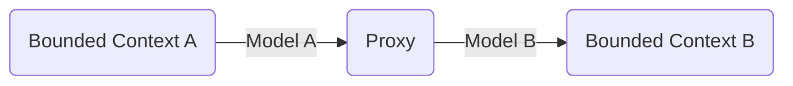
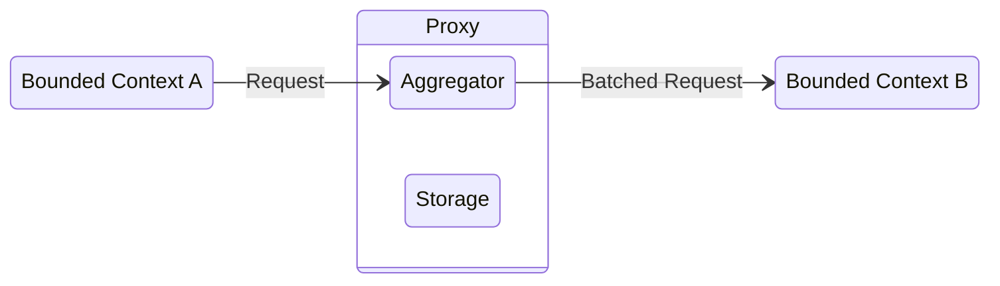

# **DDD - Bounded Context Communication**
 

## **Table Of Contents**

- [**DDD - Bounded Context Communication**](#ddd---bounded-context-communication)
  - [**Table Of Contents**](#table-of-contents)
  - [**Model Translation**](#model-translation)
    - [**Stateless**](#stateless)
    - [**Stateful**](#stateful)

 
 
 
 

## **Model Translation**
 
 

### **Stateless**

In a stateless model translation the bounded contexts communicate via a proxy.

 

 
 
 

### **Stateful**

A stateful model translation is used when the translation includes aggregating data in some way.

 

