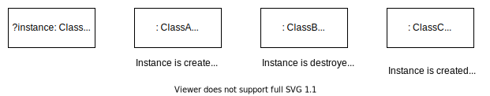
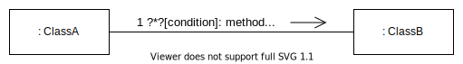
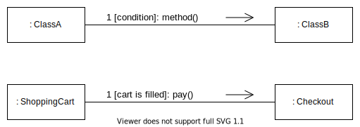
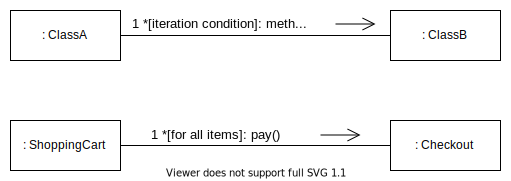

# **UML Communication Diagram**
 

## **Table Of Contents**
 

- [**UML Communication Diagram**](#uml-communication-diagram)
  - [**Table Of Contents**](#table-of-contents)
  - [**Basics**](#basics)
  - [**Object**](#object)
  - [**Message**](#message)
    - [**Condition**](#condition)
    - [**Iteration**](#iteration)
    - [**Enumeration**](#enumeration)
      - [**Ordinal Numbers**](#ordinal-numbers)
      - [**Hierarchical Decimal Numbers**](#hierarchical-decimal-numbers)

 
 
 
 

## **Basics**

> A **communication diagram** (formerly known as **collaboration diagram**) models the sequential flow of messages between different class instances without any time specification.

 
 
 
 

## **Object**

 
 
 
 

## **Message**

 
 
 

### **Condition**

 
 
 

### **Iteration**

 
 
 

### **Enumeration**
 

#### **Ordinal Numbers**

Messages are numbered with natural numbers.

 
 

#### **Hierarchical Decimal Numbers**

Messages are numbered with decimal numbers.

