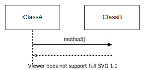
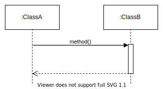

# **UML Sequence Diagram**
 

## **Table Of Contents**

- [**UML Sequence Diagram**](#uml-sequence-diagram)
  - [**Table Of Contents**](#table-of-contents)
  - [**Basics**](#basics)
  - [**Object**](#object)
  - [**Messages**](#messages)
    - [**Synchronous Message**](#synchronous-message)
    - [**Asynchronous Message**](#asynchronous-message)
    - [**Return Message**](#return-message)
  - [**Activity Elements**](#activity-elements)
    - [**Activity Bar**](#activity-bar)

 
 
 
 

## **Basics**

> A **sequence diagram** models complex interactions between different class instances within a specific time frame.

 

 
 
 
 

## **Object**

> An **object** is an instance of a class that has a dotted lifeline.  
> Objects can get created during the diagram lifespan by an incoming arrow.  
> Objects can get destroyed during the diagram lifespan by a cross on their lifeline.

 

 
 
 
 

## **Messages**
 
 

### **Synchronous Message**

> The sender of a **synchronous message** waits idle until the receiver has processed it.

 

 
 

### **Asynchronous Message**

> The sender of an **asynchronous message** can concurrently continue its execution without having to wait until the receiver processed the message.

 

 
 

### **Return Message**

> The optional `return message` indicates that the receiver has processed the message of the sender.

 

 
 
 
 

## **Activity Elements**
 
 

### **Activity Bar**

> An **activity bar** on a lifeline of an object represents the time period between receiving a message and sending an answer.

 

