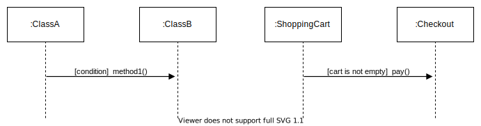

# **UML Sequence Diagram**
 

## **Table Of Contents**

- [**UML Sequence Diagram**](#uml-sequence-diagram)
  - [**Table Of Contents**](#table-of-contents)
  - [**Basics**](#basics)
  - [**Object**](#object)
  - [**Activity Elements**](#activity-elements)
    - [**Activity Bar**](#activity-bar)
    - [**Active Objects**](#active-objects)
  - [**Control Flow**](#control-flow)
    - [**Messages**](#messages)
      - [**Synchronous Message**](#synchronous-message)
      - [**Asynchronous Message**](#asynchronous-message)
      - [**Return Message**](#return-message)
    - [**Conditional**](#conditional)
      - [**Guard Syntax**](#guard-syntax)
      - [**If-Else Syntax**](#if-else-syntax)
    - [**Iteration**](#iteration)
      - [**Single Method**](#single-method)
      - [**Method Block**](#method-block)
  - [**Comment**](#comment)

 
 
 
 

## **Basics**

> A **sequence diagram** models complex interactions between different class instances within a specific time frame.

 

 
 
 
 

## **Object**

> An **object** is an instance of a class that has a dotted lifeline.  
> Objects can get created during the diagram lifespan by an incoming arrow.  
> Objects can get destroyed during the diagram lifespan by a cross on their lifeline.

 

 
 
 
 

## **Activity Elements**
 
 

### **Activity Bar**

> An **activity bar** on a lifeline of an object represents the time period between receiving a message and sending an answer.

 

 

 
 
 

### **Active Objects**

> **Active objects** are all objects that execute methods concurrently to one another due to one or multiple [asynchronous messages](#asynchronous-message).  
> We mark active objects with a bold frame.

 

 
 
 
 

## **Control Flow**
 
 

### **Messages**
 

#### **Synchronous Message**

> The sender of a **synchronous message** waits idle until the receiver has processed it.

 

 
 

#### **Asynchronous Message**

> The sender of an **asynchronous message** can concurrently continue its execution without having to wait until the receiver processed the message.

 

 
 

#### **Return Message**

> The optional `return message` indicates that the receiver has processed the message of the sender.

 

 
 
 

### **Conditional**

> A **conditional** method is only executed if the condition is fulfilled.

 
 

#### **Guard Syntax**

 
 

#### **If-Else Syntax**

 
 
 

### **Iteration**

> An **iteration** executes a single method or a block of methods multiple times.

 

|Iteration Condition |Example                   |
|:-------------------|:-------------------------|
|Number              |`[5]`                     |
|Range               |`[2..7]`                  |
|Boolean             |`[list.items > ]5`        |
|Text                |`[for all items in list]` |

 
 

#### **Single Method**

 
 

#### **Method Block**

 

Alternative notation:

 
 
 
 

## **Comment**

Comments can be added left from the sequence diagram.

 

