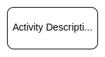
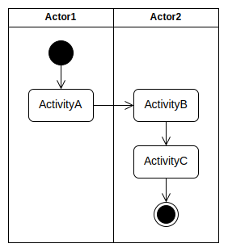
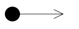
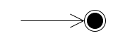
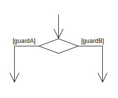
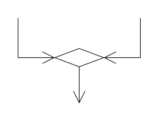
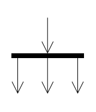
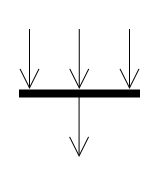

# **UML Activity Diagram**
 

## **Table Of Contents**
 

- [**UML Activity Diagram**](#uml-activity-diagram)
  - [**Table Of Contents**](#table-of-contents)
  - [**Action**](#action)
  - [**Swim Lanes**](#swim-lanes)
  - [**Flow Control**](#flow-control)
    - [**Start Node**](#start-node)
    - [**End Node**](#end-node)
    - [**Decision Node**](#decision-node)
    - [**Merge Node**](#merge-node)
    - [**Fork Node**](#fork-node)
    - [**Join Node**](#join-node)

 
 
 
 

## **Action**

> An **action** is an event within the flow of the diagram.

 

 
 
 
 

## **Swim Lanes**

> A **swin lane** represents the domain of an actor that participates in the flow.

 

 
 
 
 

## **Flow Control**
 
 

### **Start Node**

> A **start node** represents the beginning of the flow.

 

 
 
 

### **End Node**

> An **end node** represents the end of the flow.

 

 
 
 

### **Decision Node**

> A **decision node** splits the flow into different flow paths based on a boolean guard condition.

 

 
 
 

### **Merge Node**

> A **merge node** merges multiple flow paths.

 

 
 
 

### **Fork Node**

> A **fork node** splits the flow into multiple _concurrent_ flows.

 

 
 
 

### **Join Node**

> A **join node** synchronizes multiple _concurrent_ flows to a single flow.

 

