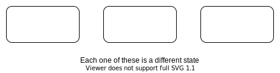
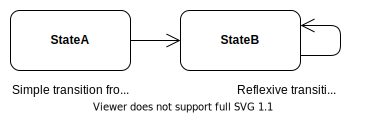

# **UML State Diagram**
 

## **Table Of Contents**
 

- [**UML State Diagram**](#uml-state-diagram)
  - [**Table Of Contents**](#table-of-contents)
  - [**Basics**](#basics)
  - [**States**](#states)
    - [**Basic State**](#basic-state)
    - [**Pseudo States**](#pseudo-states)
      - [**Initial State**](#initial-state)
      - [**Final State**](#final-state)
  - [**Transition**](#transition)
    - [**Event**](#event)
    - [**Guard**](#guard)

 
 
 
 

## **Basics**

> A **state diagram** models the behavior of objects according to their state.

 
 
 
 

## **States**
 
 
 

### **Basic State**

> A **state** is an abstraction of the concrete property values and relationships of an entity.

 

 

By definition multiple state symbols without a name represent **different** states:

 

By definition multiple state symbols with the same name represent the **same** state:

 
 
 

### **Pseudo States**
 
 

#### **Initial State**

> The **initial pseudo state** represents the entry point to the diagram and transitions to exactly one state without any event or guard.

 

 
 

#### **Final State**

> The **final state** represents the exit of the diagram.

 

 
 
 
 

## **Transition**

> A **transition** changes the current state to another (or the same) state.  
> Transitions without an [event](#event) or [guard](#guard) are executed immediately on entering a state.

 

 
 
 

### **Event**

> An **event** is a trigger for a transition.

 

|Event Type   |Description                                          |
|:------------|:----------------------------------------------------|
|call event   |an operation of the object has been called           |
|change event |instantiation or deletion of object or relationships |
|time event   |point of time reached or time interval passed        |
|signal event |outside signal                                       |

 

 
 
 

### **Guard**

> A **guard** is a condition for a transition to take place. It can take parameters and use object attributes or relationships.

 

