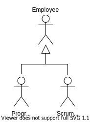
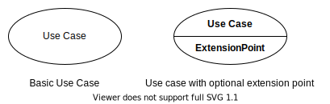
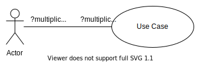
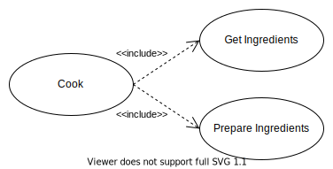
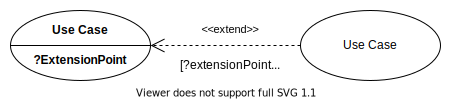
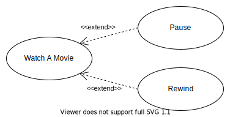
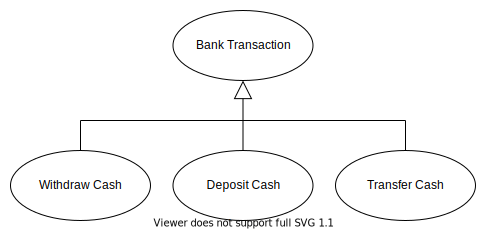

# **UML Use Case Diagram**
 

## **Table Of Contents**
 

- [**UML Use Case Diagram**](#uml-use-case-diagram)
  - [**Table Of Contents**](#table-of-contents)
  - [**Actor**](#actor)
    - [**Generalization**](#generalization)
  - [**Use Case**](#use-case)
    - [**Relationships**](#relationships)
      - [**Association**](#association)
      - [**Include**](#include)
      - [**Extend**](#extend)
      - [**Generalisation**](#generalisation)

 
 
 
 

## **Actor**

> An **actor** represents a role of an external entity (i.e. human or technical user) that interacts with the system.  
> A specific external entity can have multiple roles. 

 

 
 

### **Generalization**

Actors can be in a generalization relationship with each other. The sub actors inherit the use case interactions of their super actor.

 

 
 
 
 

## **Use Case**

> A **use case** is a subfunctionality of a system that is used by at least one [actor](#actor).

 

 
 
 

### **Relationships**
 

#### **Association**

> An **association** between an [actor](./pictures/use-case-diagram/uml_use_case_diagram_actor.svg) and a [use case](./pictures/use-case-diagram/uml_use_case_diagram_use_case.svg) indicates a communication or interaction between them.

 

 
 

#### **Include**

> An **include** relationship allows a base use case to include the functionality of one or multiple other use cases.  
> The base use case is not complete without the included use cases.

 

 
 

#### **Extend**

> An **extend** relationship is an **optional** extension of a base use case with the functionality of one or multiple other use cases.  
> The base use case is complete without the extended use cases.

 

 

 
 

#### **Generalisation**

> A **generalization** relationship is the realization of an incomplete abstract use case (super case) by a complete concrete use case (sub case).

 

