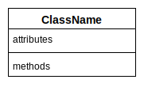

# **UML Class Diagram**
<br>

## **Table Of Contents**
<br>

- [**UML Class Diagram**](#uml-class-diagram)
  - [**Table Of Contents**](#table-of-contents)
  - [**Class**](#class)
    - [**Name**](#name)
    - [**Attributes**](#attributes)
      - [**Notation**](#notation)
      - [**Instance Attributes**](#instance-attributes)
      - [**Class Attribute / Static Attribute**](#class-attribute--static-attribute)
      - [**Derived Attribute**](#derived-attribute)
    - [**Methods**](#methods)
      - [**Notation**](#notation-1)
      - [**Instance Methods**](#instance-methods)
        - [**Standard Instance Methods**](#standard-instance-methods)
      - [**Class Methods**](#class-methods)
      - [**Abstract Methods**](#abstract-methods)
    - [**Associations**](#associations)
      - [**Association**](#association)
        - [**Direction**](#direction)
        - [**Multiplicity**](#multiplicity)
        - [**Association Class**](#association-class)
      - [**Inheritance**](#inheritance)
      - [**Aggregation**](#aggregation)
      - [**Composition**](#composition)
      - [**Dependency**](#dependency)
  - [**Interfaces**](#interfaces)

<br>
<br>
<br>
<br>

## **Class**

> A **class** is an abstract data type that describes the attributes and methods of a set of objects without taking into account their state, identity or existence.

<br>

Basic Notation:



<br>
<br>
<br>

### **Name**

A class is identified by their name which is written in **CamelCase**.


<br>
<br>
<br>

### **Attributes**
<br>

#### **Notation**

```javascript
?visibilityFlag attributeName: ?type ?[multiplicity] ?= defaultValue ?{modificationFlag}
```

<br>

|**Visibility Flag** |Meaning   |Accessible From           |
|:------------------:|:---------|:-------------------------|
|`+`                 |public    |everywhere                |
|`-`                 |private   |within the same instance  |
|`#`                 |protected |subclasses                |
|`~`                 |package   |same package as the class |

<br>

|**Type**    |Description                |
|:-----------|:--------------------------|
|primitive   |int, boolean, ...          |
|enumeration |predefined set of literals |
|class       |                           |
|interface   |                           |

<br>

|**Multiplicity** |Description                              |
|:----------------|:----------------------------------------|
|`n`              |exactly n instances                      |
|`n..m*`          |at least n but not more than m instances |
|`n..*`           |at least n instances                     |
|`*`              |zero or more instances                   |

<br>

|**Modification Flags** |attribute                                           |
|:----------------------|:---------------------------------------------------|
|`changeable`           |value can be changed                                |
|`readOnly`             |value can not be changed                            |
|`id`                   |property is part of the identifier of the class     |
|`unique`               |multi valued property can not have duplicate values |

<br>
<br>

#### **Instance Attributes**

> An **instance attribute** is an attribute whose value is stored separately for every instance of the class.


<br>

**Example**


<br>
<br>

#### **Class Attribute / Static Attribute**

> A **class attribute** is an attribute whose value is stored once for all instances of the class.

<br>


<br>
<br>

#### **Derived Attribute**

> A **derived attribute** is calculated from other attributes.

<br>


Here the attribute `duration` is calculated.

<br>
<br>
<br>

### **Methods**

> A **method** can access attributes and alter the state of an instance by modifying its attributes.  
> It can also take inputs and interact with other instances.  
> A method is identified by its **signature** which consists of the method´s name, parameter list and its return type.

<br>
<br>

#### **Notation**

```javascript
?visibility methodName(?parameterMode parameterName: ?parameterType, ...): returnType
```

<br>

|**Visibility Flag** |Meaning   |Accessible From           |
|:------------------:|:---------|:-------------------------|
|`+`                 |public    |everywhere                |
|`-`                 |private   |within the same instance  |
|`#`                 |protected |subclasses                |
|`~`                 |package   |same package as the class |

<br>

|**Parameter Mode** |Description                                 |
|:------------------|:-------------------------------------------|
|`in`               |pass argument by value                      |
|`inout`            |pass argument by reference                  |
|`out`              |pass result to reference parameter argument |

<br>

|**Type**    |Description                |
|:-----------|:--------------------------|
|primitive   |int, boolean, ...          |
|enumeration |predefined set of literals |
|class       |                           |
|interface   |                           |

<br>
<br>

#### **Instance Methods**
<br>

> An **instance method** can be invoked on every instance of the class.

<br>


<br>
<br>

##### **Standard Instance Methods**

The following instance methods are always assumed to be part of a class without being explicitly specified in the diagram:

|Standard Method                        |Description                                               |
|:--------------------------------------|:---------------------------------------------------------|
|`setAttribute(): type`                 |Setter method for attributes                              |
|`getAttribute(in value: type)`         |Getter method for attributes                              |
|`getAssociation(): type`               |Getter method for association                             |
|`createAssociation(in instance: type)` |Create association between current and parameter instance |
|`deleteAssociation(in instance: type)` |Delete association between current and parameter instance |

<br>
<br>

#### **Class Methods**

> A **class method** is a method that is implemented on the class level.  
> It can therefore only be called on the class and can not use instance attributes or methods.


<!-- ```mermaid
classDiagram
    class Person {
        -firstName: string = 'John'
        -lastName: string = 'Doe'

        printText(in text: string)$ void
        +introduce(in greeting: string) string
        +changeName(in firstName: string, in lastName: string) boolean
    }
``` -->

<br>
<br>

#### **Abstract Methods**

> An **abstract method** is a method signature without implementation.  
> The implementation has to be handled by the subclasses.

<br>

An abstract method is noted with a _cursive_ name.


<br>
<br>

### **Associations**
<br>
<br>

#### **Association**
<br>


<br>
<br>

##### **Direction**
<br>


* All connected instances know about the connection

<br>


* only instances of A know about their connection to instances of B

<br>


* connected instances do not know about the connection

<br>
<br>

##### **Multiplicity**
<br>

Multiplicity defines upper and lower boundaries for connected instances:

|Multiplicity |Shorthand |Description                                |
|:-----------:|:--------:|-------------------------------------------|
|1..1         |1         |exactly one connected instance             |
|0..1         |          |no or exactly one connected instance       |
|1..*         |          |many connected instances, but at lease one |
|0..*         |*         |no or many connected instances             |
|_number_     |          |exactly _number_ of connected instances    |
|[2, 3]       |          |range for number of connected instances    |

<br>

Examples:


* every instance of A is connected to exactly one instance of B
* every instance of B is connected to exactly one instance of A

<br>


* every instance of A is connected to one or multiple instances of B
* every instance of B is connected to either none or exactly one instance of A

<br>
<br>

##### **Association Class**
<br>

* class assigned to a specific association between classes
* used to model additional attributes or methods of an association
* association class represents exactly one association!


<br>
<br>

#### **Inheritance**
<br>


<br>
<br>

#### **Aggregation**
<br>


* defines a relationship between a whole and its parts
* whole has the reponsibility to deal with its parts
* parts can exist without their whole

<br>
<br>

#### **Composition**
<br>


* defines a relationship between a whole and its parts
* parts can not exist without their whole
* parts can only be part of a single whole

<br>
<br>

#### **Dependency**
<br>


<br>
<br>
<br>

## **Interfaces**
<br>

* lists only method signatures
* can not be instantiated

