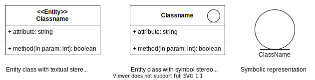
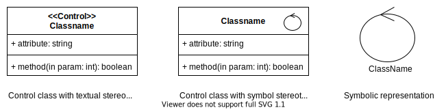

# **UML Class Diagram**
<br>

## **Table Of Contents**
<br>

- [**UML Class Diagram**](#uml-class-diagram)
  - [**Table Of Contents**](#table-of-contents)
  - [**Class**](#class)
    - [**Name**](#name)
    - [**Attributes**](#attributes)
      - [**Notation**](#notation)
      - [**Instance Attributes**](#instance-attributes)
      - [**Class Attribute / Static Attribute**](#class-attribute--static-attribute)
      - [**Derived Attribute**](#derived-attribute)
    - [**Methods**](#methods)
      - [**Notation**](#notation-1)
      - [**Instance Methods**](#instance-methods)
        - [**Standard Instance Methods**](#standard-instance-methods)
      - [**Class Methods**](#class-methods)
        - [**Standard Class Methods**](#standard-class-methods)
      - [**Abstract Methods**](#abstract-methods)
    - [**Class Stereotypes**](#class-stereotypes)
      - [**Entity Class**](#entity-class)
      - [**Control Class**](#control-class)
      - [**Boundary Class**](#boundary-class)
    - [**Constraints**](#constraints)
  - [**Relationships**](#relationships)
    - [**Association**](#association)
      - [**Notation**](#notation-2)
      - [**Navigability**](#navigability)
        - [**Unspecified**](#unspecified)
        - [**Unnavigable**](#unnavigable)
        - [**Unidirectional**](#unidirectional)
        - [**Bidirectional**](#bidirectional)
      - [**Multiplicity**](#multiplicity)
      - [**Association Class**](#association-class)
      - [**Constraints**](#constraints-1)
    - [**Generalization**](#generalization)
    - [**Aggregation**](#aggregation)
    - [**Composition**](#composition)
    - [**Dependency**](#dependency)
  - [**Interfaces**](#interfaces)
    - [**Detailed Notation**](#detailed-notation)
    - [**Lollipop Notation**](#lollipop-notation)
  - [**Abstract Class**](#abstract-class)
  - [**Package**](#package)
    - [**Visibility**](#visibility)
    - [**Relationship**](#relationship)
      - [**Import**](#import)
      - [**Access**](#access)
  - [**Textual Specification**](#textual-specification)

<br>
<br>
<br>
<br>

## **Class**

> A **class** is an abstract data type that describes the attributes and methods of a set of objects without taking into account their state, identity or existence.

<br>

Basic Notation:


<br>
<br>
<br>

### **Name**

A class is identified by their name which is written in **CamelCase**.


<br>
<br>
<br>

### **Attributes**
<br>

#### **Notation**

```javascript
?visibilityFlag attributeName: ?type ?[multiplicity] ?= defaultValue ?{modificationFlag}
```

<br>

|**Visibility Flag** |Meaning   |Accessible From           |
|:------------------:|:---------|:-------------------------|
|`+`                 |public    |everywhere                |
|`-`                 |private   |within the same instance  |
|`#`                 |protected |subclasses                |
|`~`                 |package   |same package as the class |

<br>

|**Type**    |Description                |
|:-----------|:--------------------------|
|primitive   |int, boolean, ...          |
|enumeration |predefined set of literals |
|class       |                           |
|interface   |                           |

<br>

|**Multiplicity** |Description                              |
|:----------------|:----------------------------------------|
|`n`              |exactly n instances                      |
|`n..m*`          |at least n but not more than m instances |
|`n..*`           |at least n instances                     |
|`*`              |zero or more instances                   |

<br>

|**Modification Flags** |attribute                                           |
|:----------------------|:---------------------------------------------------|
|`changeable`           |value can be changed                                |
|`readOnly`             |value can not be changed                            |
|`id`                   |property is part of the identifier of the class     |
|`unique`               |multi valued property can not have duplicate values |

<br>
<br>

#### **Instance Attributes**

> An **instance attribute** is an attribute whose value is stored separately for every instance of the class.


<br>

**Example**


<br>
<br>

#### **Class Attribute / Static Attribute**

> A **class attribute** is an attribute whose value is stored once for all instances of the class.

<br>


<br>
<br>

#### **Derived Attribute**

> A **derived attribute** is calculated from other attributes.

<br>


Here the attribute `duration` is calculated.

<br>
<br>
<br>

### **Methods**

> A **method** can access attributes and alter the state of an instance by modifying its attributes.  
> It can also take inputs and interact with other instances.  
> A method is identified by its **signature** which consists of the method´s name, parameter list and its return type.

<br>
<br>

#### **Notation**

```javascript
?visibility methodName(?parameterMode parameterName: ?parameterType, ...): returnType ?{modificationFlags}
```

<br>

|**Visibility Flag** |Meaning   |Accessible From           |
|:------------------:|:---------|:-------------------------|
|`+`                 |public    |everywhere                |
|`-`                 |private   |within the same instance  |
|`#`                 |protected |subclasses                |
|`~`                 |package   |same package as the class |

<br>

|**Parameter Mode** |Description                                 |
|:------------------|:-------------------------------------------|
|`in`               |pass argument by value                      |
|`inout`            |pass argument by reference                  |
|`out`              |pass result to reference parameter argument |

<br>

|**Type**    |Description                |
|:-----------|:--------------------------|
|primitive   |int, boolean, ...          |
|enumeration |predefined set of literals |
|class       |                           |
|interface   |                           |

<br>

|**ModificationFlags** |Description                                    |
|:---------------------|:----------------------------------------------|
|`isQuery`             |method access attributes without modifying any |
|`isModifier`          |method modifies attributes                     |
|`unique`              |return value has no duplicates                 |

<br>
<br>

#### **Instance Methods**

> An **instance method** can be invoked on every instance of the class.

<br>


<br>
<br>

##### **Standard Instance Methods**

The following instance methods are always assumed to be part of a class without being explicitly specified in the diagram:

|Standard Method                        |Description                                               |
|:--------------------------------------|:---------------------------------------------------------|
|`setAttribute(): type`                 |Setter method for attributes                              |
|`getAttribute(in value: type)`         |Getter method for attributes                              |
|`getAssociation(): type`               |Getter method for association                             |
|`createAssociation(in instance: type)` |Create association between current and parameter instance |
|`deleteAssociation(in instance: type)` |Delete association between current and parameter instance |
|`delete()`                             |Delete current instance                                   |

<br>
<br>

#### **Class Methods**

> A **class method** is a method that is implemented on the class level.  
> It can therefore only be called on the class and can not use instance attributes or methods.


<br>
<br>

##### **Standard Class Methods**

The following class method is always assumed to be part of a class without being explicitly specified in the diagram:

|Standard Method           |Description                     |
|:-------------------------|:-------------------------------|
|`create(): classInstance` |creates a new instance of class |

<br>
<br>

#### **Abstract Methods**

> An **abstract method** is a method signature without implementation.  
> The implementation has to be handled by the subclasses.

<br>

An abstract method is noted with a _cursive_ name.


<br>
<br>
<br>

### **Class Stereotypes**
<br>
<br>

#### **Entity Class**

> An **entity class** describes a specific entity of the domain.  
> Instances are typically long-lived and hold a large chunk of information.

<br>



<br>
<br>

#### **Control Class**

> A **control class** manages the flow of interactions between the entity classes within a specific scenario.  

<br>



<br>
<br>

#### **Boundary Class**

> A **boundary class** encapsulates the interactions between a specific actor and the system.  
> It is typically located on the periphery of the system or a subsystem.

<br>


<br>
<br>
<br>

### **Constraints**

> A **class constraint** is a condition, restriction or assertion for one or multiple attributes or methods.

<br>


<br>
<br>
<br>
<br>

## **Relationships**
<br>
<br>
<br>

### **Association**

> An **association** is a relationship between instances of either different classes or the same class (reflexive association).  
> An association is conceptulized as a set of tuples.  
> Therefore two instances can have only **one** association of the specified type.

<br>


<br>
<br>

#### **Notation**


<br>

  
N-ary association

<br>
<br>

#### **Navigability**
<br>
<br>

##### **Unspecified**


- Navigability from A to B is unspecified
- Navigability from B to A is unspecified

<br>


- Navigability from A to B is unspecified
- B can not navigate to A

<br>

##### **Unnavigable**


- A can not navigate to B
- B can not navigate to A

<br>

##### **Unidirectional**


- A can navigate to B
- Navigability from B to A is unspecified

<br>


- A can navigate to B
- B can not navigate to B

<br>

##### **Bidirectional**


- A can navigate to B
- B can navigate to A

<br>
<br>

#### **Multiplicity**
<br>

The mulitplicity describes how many instances can be connected within a single association.

|Multiplicity |Shorthand |Description                                |
|:-----------:|:--------:|-------------------------------------------|
|`1..1`       |1         |exactly one connected instance             |
|`0..1`       |          |no or exactly one connected instance       |
|`1..*`       |          |many connected instances, but at least one |
|`0..*`       |*         |zero or many connected instances           |
|`_number_`   |          |exactly _number_ of connected instances    |
|`[2, 3]`     |          |range for number of connected instances    |

<br>

|Shorthand |first end          |second end         |
|:--------:|:------------------|-------------------|
|`1:1`     |`1` or `0..1`      |`1` or `0..1`      |
|`1:n`     |`1` or `0..1`      |`0..n`, `n` or `*` |
|`n:m`     |`0..n`, `n` or `*` |`0..n`, `n` or `*` |

<br>


- every instance of A is connected to exactly one instance of B
- every instance of B is connected to exactly one instance of A

<br>


- every instance of A is connected to one or multiple instances of B
- every instance of B is connected to either none or exactly one instance of A

<br>
<br>

#### **Association Class**

> An **association class** is used to model attributes or methods of a specific association when these attributes or methods are not a logical part of the classes of the connected instances.

<br>


<br>

Example


<br>
<br>

#### **Constraints**

> A **class constraint** is a condition, restriction or assertion for one or multiple relationships.

<br>


<br>


<br>
<br>
<br>

### **Generalization**

> A **generalization** is a relationship between two classes where one class (**sub class**) inherits all attributes and methods of the other class (**super class**).  
> Instances of the sub class can be used in place of instances of the super class (substitution principle).

<br>


<br>
<br>
<br>

### **Aggregation**

> An **aggregation** is a relationship between a whole and its parts. The whole has the responsibility to deal with its parts.  
> The parts can exist outside of the whole.

<br>


<br>
<br>
<br>

### **Composition**

> A **composition** is a relationship between a whole and its parts. The whole has the responsibility to deal with its parts.  
> The parts can only be part of a single whole and can not exist outside of it.

<br>


<br>
<br>
<br>

### **Dependency**

> A **dependency** is a relationship between an element that requires, needs or depends on another element for its specification or implementation. Also called **supplier-client relationship**.

<br>


<br>

|Dependency Type |Description              |
|:---------------|:------------------------|
|`<<use>>`       |A uses B in some way     |
|`<<create>>`    |A creates instances of B |
|`<<call>>`      |A calls some method of B |
|`<<realizes>>`  |A realizes interface     |

<br>
<br>
<br>
<br>

## **Interfaces**

> An **interface** is a set of public method signatures.  
> Classes that realize one or multiple interfaces have to implement the specified methods as a part of their public interface.

<br>

> **Concept**: An interface is a contract between classes about which methods can be used in their communication.

<br>
<br>

### **Detailed Notation**


<br>
<br>

### **Lollipop Notation**


<br>
<br>
<br>
<br>

## **Abstract Class**

> An **abstract class** is a class that has at least one [abstract method](#abstract-methods) and can not be instantiated.  
> It can also contain attributes and implement methods.

<br>


Abstract class with italic class name.

<br>


Abstract class with prefix.

<br>
<br>
<br>
<br>

## **Package**

> A **package** is a namespace that groups semantically related elements.  
> Every element within the system can only be part of one package.

<br>


<br>


<br>
<br>

### **Visibility**

|**Visibility Flag** |Meaning   |Accessible From                              |
|:------------------:|:---------|:--------------------------------------------|
|`+`                 |public    |inside and outside of the package            |
|`-`                 |private   |inside of the package                        |
|`~`                 |package   |inside of the package and in all subpackages |

<br>

> **Attention:** Elements of subpackages are not automatically visible to superpackages! Use `import` dependency.

<br>
<br>

### **Relationship**
<br>

#### **Import**

> The **import** relationship imports a specific or all elements of a package into a namespace and **makes them visible to the outside**.

<br>


<br>
<br>

#### **Access**

> The **access** relationship imports a specific or all elements of a package into a namespace and **does not make them visible to the outside**.

<br>


<br>
<br>
<br>
<br>

## **Textual Specification**

> The **textual specification** is an alternative way to model a class that allows for a more precise description.

<br>

**class** ClassName  
&nbsp;&nbsp;&nbsp;&nbsp;&nbsp;&nbsp;**responsibilites:** *text*  
&nbsp;&nbsp;&nbsp;&nbsp;&nbsp;&nbsp;**comment:** *text*  
&nbsp;&nbsp;&nbsp;&nbsp;&nbsp;&nbsp;**inv:** *class invariant (condition that has to be fulfilled before and after each operation execution)*  
&nbsp;&nbsp;&nbsp;&nbsp;&nbsp;&nbsp;**features:**  
&nbsp;&nbsp;&nbsp;&nbsp;&nbsp;&nbsp;&nbsp;&nbsp;&nbsp;&nbsp;&nbsp;&nbsp;**attributes:**  
&nbsp;&nbsp;&nbsp;&nbsp;&nbsp;&nbsp;&nbsp;&nbsp;&nbsp;&nbsp;&nbsp;&nbsp;&nbsp;&nbsp;&nbsp;&nbsp;&nbsp;&nbsp;*visibility attributeName1: type (= default)*  
&nbsp;&nbsp;&nbsp;&nbsp;&nbsp;&nbsp;&nbsp;&nbsp;&nbsp;&nbsp;&nbsp;&nbsp;&nbsp;&nbsp;&nbsp;&nbsp;&nbsp;&nbsp;*visibility attributeName2: type (= default)*  
&nbsp;&nbsp;&nbsp;&nbsp;&nbsp;&nbsp;&nbsp;&nbsp;&nbsp;&nbsp;&nbsp;&nbsp;**operations:**  
&nbsp;&nbsp;&nbsp;&nbsp;&nbsp;&nbsp;&nbsp;&nbsp;&nbsp;&nbsp;&nbsp;&nbsp;&nbsp;&nbsp;&nbsp;&nbsp;&nbsp;&nbsp;*visibility operationName1(in parameterName: type): type {constraint}*  
&nbsp;&nbsp;&nbsp;&nbsp;&nbsp;&nbsp;&nbsp;&nbsp;&nbsp;&nbsp;&nbsp;&nbsp;&nbsp;&nbsp;&nbsp;&nbsp;&nbsp;&nbsp;&nbsp;&nbsp;&nbsp;&nbsp;&nbsp;&nbsp;**comment:** *text*  
&nbsp;&nbsp;&nbsp;&nbsp;&nbsp;&nbsp;&nbsp;&nbsp;&nbsp;&nbsp;&nbsp;&nbsp;&nbsp;&nbsp;&nbsp;&nbsp;&nbsp;&nbsp;&nbsp;&nbsp;&nbsp;&nbsp;&nbsp;&nbsp;**pre:** *boolean precondition to execute method*  
&nbsp;&nbsp;&nbsp;&nbsp;&nbsp;&nbsp;&nbsp;&nbsp;&nbsp;&nbsp;&nbsp;&nbsp;&nbsp;&nbsp;&nbsp;&nbsp;&nbsp;&nbsp;&nbsp;&nbsp;&nbsp;&nbsp;&nbsp;&nbsp;**post: result =** *boolean postcondition that the result has to fulfill*  
&nbsp;&nbsp;&nbsp;&nbsp;&nbsp;&nbsp;&nbsp;&nbsp;&nbsp;&nbsp;&nbsp;&nbsp;&nbsp;&nbsp;&nbsp;&nbsp;&nbsp;&nbsp;*visibility operationName2(in parameterName: type): type {constraint}*  
&nbsp;&nbsp;&nbsp;&nbsp;&nbsp;&nbsp;&nbsp;&nbsp;&nbsp;&nbsp;&nbsp;&nbsp;&nbsp;&nbsp;&nbsp;&nbsp;&nbsp;&nbsp;&nbsp;&nbsp;&nbsp;&nbsp;&nbsp;&nbsp;**comment:** *text*  
&nbsp;&nbsp;&nbsp;&nbsp;&nbsp;&nbsp;&nbsp;&nbsp;&nbsp;&nbsp;&nbsp;&nbsp;&nbsp;&nbsp;&nbsp;&nbsp;&nbsp;&nbsp;&nbsp;&nbsp;&nbsp;&nbsp;&nbsp;&nbsp;**pre:** *boolean precondition to execute method*  
&nbsp;&nbsp;&nbsp;&nbsp;&nbsp;&nbsp;&nbsp;&nbsp;&nbsp;&nbsp;&nbsp;&nbsp;&nbsp;&nbsp;&nbsp;&nbsp;&nbsp;&nbsp;&nbsp;&nbsp;&nbsp;&nbsp;&nbsp;&nbsp;**post: result =** *result definition*  
...  
**end** ClassName. 

