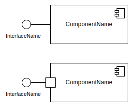
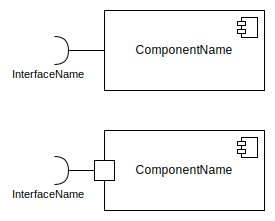
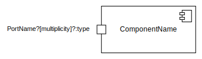
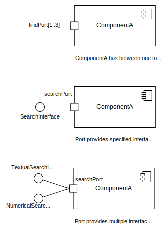
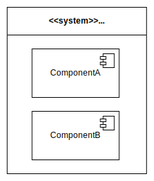
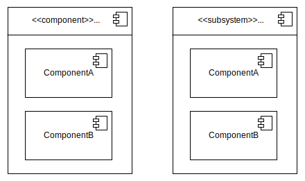
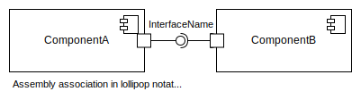
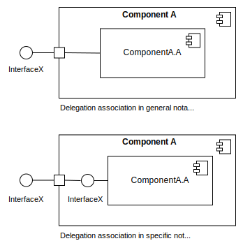

# **UML Component Diagram**
 

## **Table Of Contents**
 

- [**UML Component Diagram**](#uml-component-diagram)
  - [**Table Of Contents**](#table-of-contents)
  - [**Component**](#component)
  - [**Interfaces**](#interfaces)
    - [**Provided Interface**](#provided-interface)
    - [**Required Interface**](#required-interface)
  - [**Ports**](#ports)
  - [**System Boundary**](#system-boundary)
  - [**Nested Components**](#nested-components)
  - [**Relationships**](#relationships)
    - [**Association**](#association)
      - [**Assembly Association**](#assembly-association)
      - [**Delegation Association**](#delegation-association)
    - [**Generalization**](#generalization)
    - [**Aggregation**](#aggregation)
    - [**Composition**](#composition)
    - [**Dependency**](#dependency)

 
 
 
 

## **Component**

> A **component** represents a single hight-level funtionality within the system.

 

 
 
 
 

## **Interfaces**
 
 

### **Provided Interface**

> A **provided interface** is either
> - realized by the component itself or
> - provided by a public [port](#ports) of the component

 

 
 
 

### **Required Interface**

> A **required interface** is either
> - required by a _use_ dependency from the component itself
> - required by a public [port](#ports) of the component

 

 
 
 
 

## **Ports**

> A **port** allows the component to communicate with its environment and typically exposed [provided](#provided-interface) and/or [required](#required-interface) interfaces.

 

 

Examples:

 
 
 
 

## **System Boundary**

> A **system boundary** represents the system that contains the components.

 

 
 
 
 

## **Nested Components**

> **Nested components** are part of a super component or subsystem component.

 

 
 
 
 

## **Relationships**
 
 

### **Association**

> An **association** is a relationship between at least two components that enables communication between them.

 
 

#### **Assembly Association**

> An **assembly association** represents the usage of a service of at least one component by at least one other component.

 

 
 

#### **Delegation Association**

> A **delegation association** represents the realization of an external service of a composite component (via a port) by an internal component.

 

 
 
 

### **Generalization**

> A **generalization** is a relationship between a supercomponent and a subcomponent.

 

 
 
 

### **Aggregation**

> An **aggregation** is a relationship between a whole and its parts.  
> The parts can be included in multiple wholes or can exist without a whole.

 

 
 
 

### **Composition**

>A **composition** is a relationship between a whole and its parts.  
The parts can only be part of a single whole and can not exist outside of it.

 

 
 
 

### **Dependency**

> A **dependency** is a relationship between a client and a supplier component.  
The client component requires or depends on the supplier component for its specification or implementation.

 

