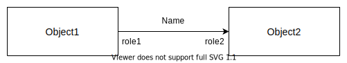

# **UML Element Diagram**
 

## **Table Of Contents**
 

- [**UML Element Diagram**](#uml-element-diagram)
  - [**Table Of Contents**](#table-of-contents)
  - [**Object**](#object)
    - [**State**](#state)
    - [**Identity**](#identity)
    - [**Operations**](#operations)
      - [**Modificator**](#modificator)
      - [**Selector**](#selector)
    - [**Equality**](#equality)
      - [**State Equality**](#state-equality)
      - [**Referential Equality**](#referential-equality)
    - [**Clone**](#clone)
  - [**Association**](#association)
    - [**Undirected Association**](#undirected-association)
    - [**Unidirectional Association**](#unidirectional-association)
    - [**Bidirectional Association**](#bidirectional-association)
  - [**Example**](#example)

 
 
 
 

## **Object**

> An **object** is an abstraction of a real world entity that is defined by its **name**, **attributes** and **operations**.

 

**Note**: Operations are not displayed in the object diagram.

 
 
 

### **State**

The state of an object is defined by the value of its attributes.

 
 
 

### **Identity**

Every object has a unique identity that is independent from its state.

 
 
 

### **Operations**
 
 

#### **Modificator**

Operation that changes the state of the object by modifying the value of one or more attributes.

 
 

#### **Selector**

Operation that simply returns the value of one or more attributes without changing the state.

 
 
 

### **Equality**
 
 

#### **State Equality**

Two objects are **equal by state** if they have the same operations, attributes and attribute values.

 
 

#### **Referential Equality**

Two objects are **equal by reference** when they have the same identity, e.g. one is an alias for the other.

 
 
 

### **Clone**

Create an object with the same state and operations than another object, but with a different identity.

 
 
 
 

## **Association**

An association connects two objects. It can have an optional name and roles.

 
 

### **Undirected Association**

 
 

### **Unidirectional Association**

 
 

### **Bidirectional Association**

 
 
 
 

## **Example**

