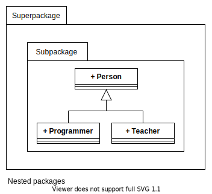

# **UML Package Diagram**
 

## **Table Of Contents**
 

- [**UML Package Diagram**](#uml-package-diagram)
  - [**Table Of Contents**](#table-of-contents)
  - [**Package**](#package)
  - [**Visibility**](#visibility)
  - [**Relationships**](#relationships)
    - [**Import**](#import)
    - [**Access**](#access)

 
 
 
 

## **Package**

> A **package** is a namespace that groups semantically related elements.  
> Every element within the system can only be part of one package.

 

 

 

> **Attention:** Elements of subpackages are not automatically visible to superpackages! Use [`import`](#import) dependency.

 
 
 
 

## **Visibility**

|**Visibility Flag** |Meaning   |Accessible From                              |
|:------------------:|:---------|:--------------------------------------------|
|`+`                 |public    |inside and outside of the package            |
|`-`                 |private   |inside of the package                        |
|`~`                 |package   |inside of the package and in all subpackages |

 
 
 
 

## **Relationships**
 
 

### **Import**

> The **import** relationship imports a specific or all elements of a package into a namespace and **makes them visible to the outside**.

 

 
 
 

### **Access**

> The **access** relationship imports a specific or all elements of a package into a namespace and **does not make them visible to the outside**.

 

