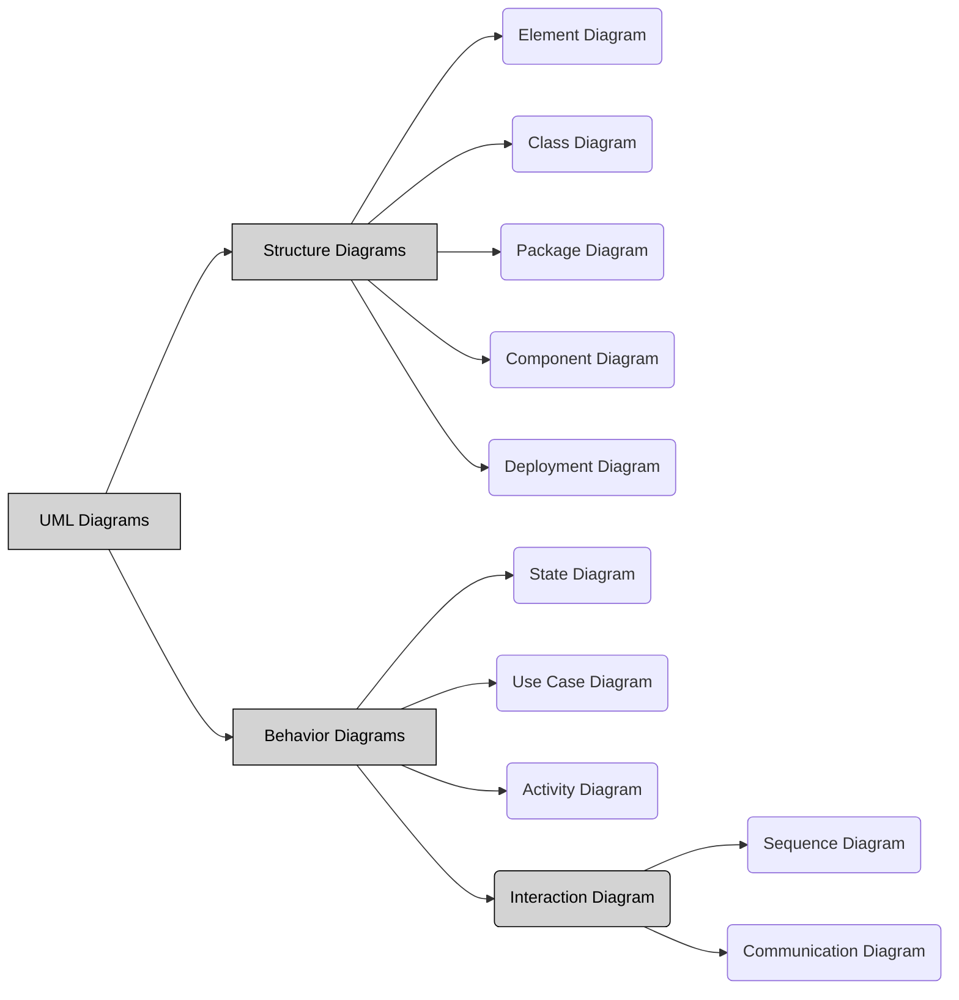

# **UML Overview**
 

```mermaid
flowchart LR
   classDef group fill:lightgray,color: black,stroke: black;

   A[UML Diagrams]:::group
   B[Structure Diagrams]:::group
   C[Behavior Diagrams]:::group
   D(Element Diagram)
   E(Class Diagram)
   F(Package Diagram)
   G(Component Diagram)
   H(Deployment Diagram)
   I(State Diagram)
   J(Use Case Diagram)
   K(Activity Diagram)
   L(Interaction Diagram):::group
   M(Sequence Diagram)
   N(Communication Diagram)

   A --> B & C
   B --> D & E & F & G & H
   C --> I & J & K & L
   L --> M & N

   click D "./structuralDiagrams/uml_element_diagram.md" _blank
   click E "./structuralDiagrams/uml_class_diagram.md" _blank
   click F "./structuralDiagrams/uml_package_diagram.md" _blank
   click G "./structuralDiagrams/uml_component_diagram.md" _blank
   click H "./structuralDiagrams/uml_deployment_diagram.md" _blank
   click I "./behavioralDiagrams/uml_state_diagram.md" _blank
   click J "./behavioralDiagrams/uml_use_case_diagram.md" _blank
   click K "./behavioralDiagrams/uml_activity_diagram.md" _blank
   click M "./behavioralDiagrams/interactionDiagrams/uml_sequence_diagram.md" _blank
   click N "./behavioralDiagrams/interactionDiagrams/uml_communication_diagram.md" _blank

```